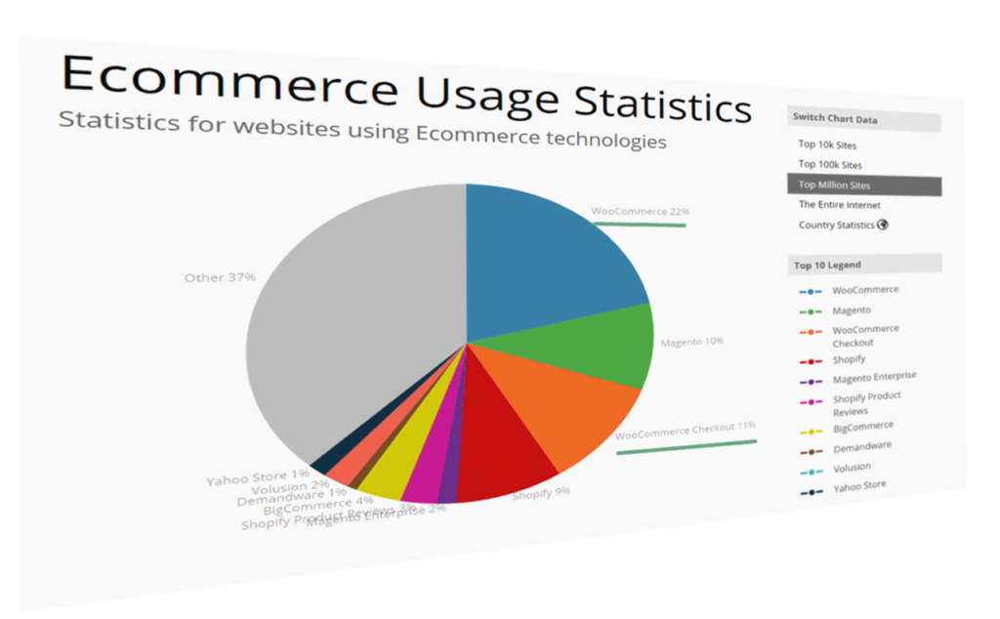
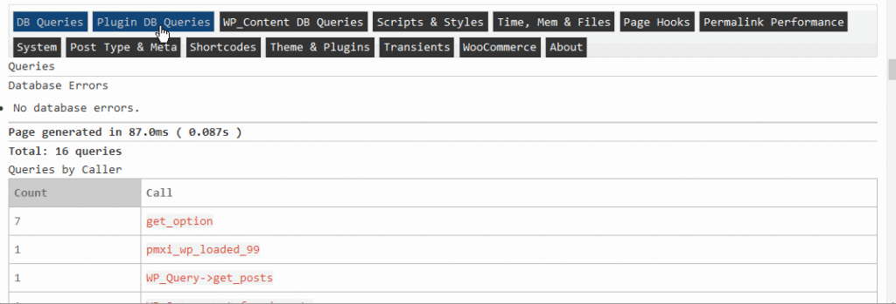
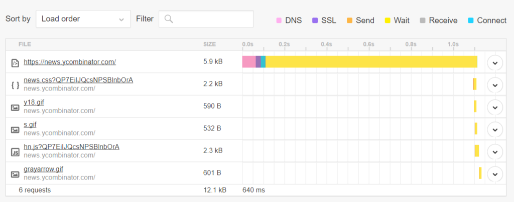
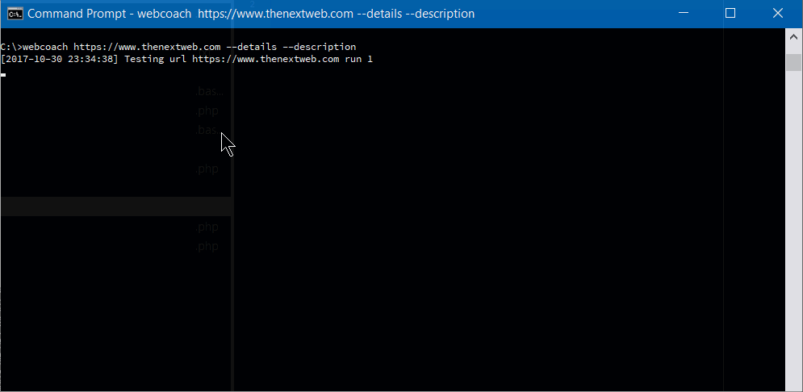
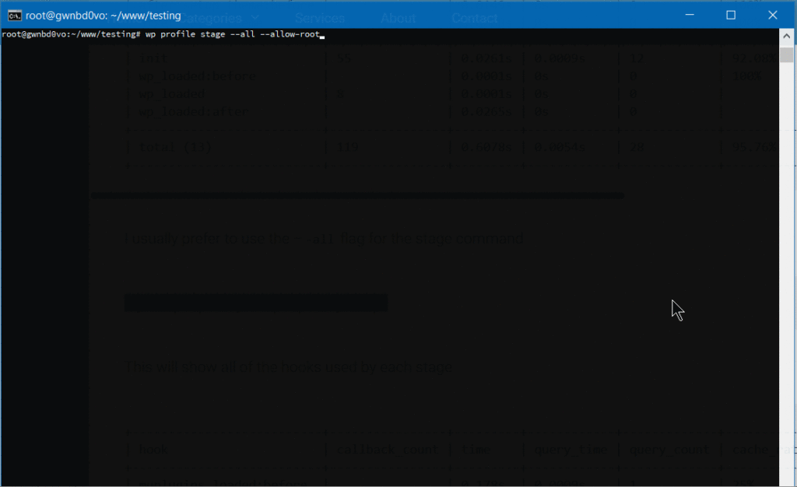

According to [Builtwith.com](https://builtwith.com), WordPress [holds close to 50%](https://trends.builtwith.com/cms) of the CMS share of the world's top 1,000,000 websites. As for the ecommerce sphere, we're at 33% with WooCommerce. And if we cast a wider net, percentages go higher. Although we may complain that WordPress can get bloated, resource-heavy, and its data model leaves a lot to be desired, there is no denying that WordPress is everywhere.



WordPress can thank its simplicity and a low barrier to entry for this pervasiveness. It's easy to set up, and requires next to no technical knowledge. Hosting for WordPress can be found for as little as a couple of dollars per month, and the basic setup takes just a half hour of clicking. Free themes for WordPress are galore, some with included WYSIWYG page builders.

Many look down on it, but in many ways we can thank WordPress for the growth of the internet and PHP, and many internet professionals have WP's gentle learning curve to thank for their careers.

But this ease of entry comes at a cost. Plenty of websites that proudly wear the WordPress badge were not done by professionals but by the cheapest developers. And often, it shows. Professional look and professional performance were afterthoughts.

One of the main points of feedback the owner of an aspiring high-quality website will get from a grudging professional is that performance and a professional look and feel shouldn't be afterthoughts. You can't easily paint or stick them over a website. Professional websites should be premeditated.


A famous UK used car dealer, Ling's Cars, tried a unique way to make a kitsch marketing punchline. Unless you're REALLY sure about what you're doing, DO NOT try this at home.

And this starts with…

## Choice of Hosting

Typically, new users will go with products that are on the low-cost side, with most of beginner-friendly bells and whistles. Considering the [shady business practices](https://www.reviewhell.com/blog/endurance-international-group-eig-hosting/) by some big industry players in this arena, and the complaints and demands for site migration professionals coming from clients, this is a part of website setup that requires due attention.

We can divide WordPress hosting vendors into a few tiers.

Premium, WordPress-dedicated vendors like [Kinsta](https://kinsta.com/pricing/) whose plans start at $100 per month, or even higher-grade managed hosting like [WordPress VIP](https://vip.wordpress.com/) by Automattic, may be worth their salt, but also may be out of reach for many website owners.

Medium tier [Flywheel](https://getflywheel.com), [A2 hosting](https://www.a2hosting.com/), [Siteground](https://www.siteground.com/) and [Pantheon](https://pantheon.io) are among those considered reliable and performance oriented, offering acceptable speed and a managed hosting service for those more price-conscious. Users here may get a bit less hand-holding, but these services usually strike an acceptable balance between a solid setup, price, and options for more advanced users. Not to forget, there is [Cloudways](https://www.cloudways.com/en/), which is a hybrid between VPS and managed hosting. Those with their audience in Europe may look into [Pilvia](https://pilvia.com/pricing/), as it offers a performant server stack and is pretty affordable.

There's an interesting survey of customer satisfaction with more prominent hosting vendors, [published by Codeinwp](https://www.codeinwp.com/blog/wordpress-hosting-infographic/).

For those of us not scared of the command line, there are VPS and dedicated-server vendors like [Digital Ocean](https://www.digitalocean.com/), [Vultr](https://www.vultr.com/), [Linode](https://www.linode.com/), Amazon's [Lightsail](https://amazonlightsail.com/), [Hetzner](https://www.hetzner.de/) in Europe, and [OVH](https://www.ovh.com/us/). Hetzner is a German vendor known for its quality physical servers on offer, somewhat above the price of virtual servers, while OVH offers very [cost-efficient virtual servers](https://www.ovh.com/us/vps/vps-ssd.xml). For the price-conscious, OVH's subsidiary [Kimsufi](https://www.kimsufi.com/en/) in Europe and Canada also offers bargain physical dedicated servers, and [Host US](https://hostus.us/kvm-vps.html) has very affordable virtual servers.

With managed hosting, things to look for are a good **server stack**, good CDN integration, and of course SSD storage. Guaranteed resources, [like with A2](https://www.a2hosting.com/web-hosting/compare), are a big plus. The next thing to look for is SSH-access. Tech-savvy users may profit from [WP-CLI](http://wp-cli.org/) availability.

When choosing a VPS, the thing to look for is XEN or KVM virtualization over OpenVZ, because it mitigates the overselling of resources, helping guarantee that the resources you bought are really yours. It also provides better security.

[Easy Engine](https://easyengine.io/) is software that can make your entire VPS/WordPress installation a one-hour job.

Regarding the server stack, Nginx is preferred to Apache if we're pursuing performance, and PHP 7 is a must. If we really need Apache, using Nginx as a reverse proxy is a plus, but this setup can get complex.

[Tests performed](https://www.cloudways.com/blog/php-5-6-vs-php-7-symfony-benchmarks/) give PHP 7 a big edge over the previous version. [According to fasthosts.co.uk](http://blogs.fasthosts.co.uk/web-design/php-7-performance-improvements/):

> WordPress 4.1 executed 95% more requests per second on PHP 7 compared to PHP 5.6.

When choosing your hosting, be aware of negative experiences with some providers that have [become notorious](https://www.reviewhell.com/blog/endurance-international-group-eig-hosting/).

## Software Considerations

Things that usually slow down WordPress websites are bulky, bloated front ends with a lot of static resources and database queries. These issues arise from the choice of theme (and its page builders, huge sliders, etc) --- which not only slow down initial loading due to many requests and overall size, but often slow down the browser due to a lot of JavaScript, and stuff to render, making it unresponsive.

The golden rule here is: **don't use it unless there's a good reason to.**

This may seem like a rule coming from the mouth of Homer Simpson, but if you can skip any of the bells and whistles, do so. Be conservative. If you must add some shiny functionality or JS eye candy, always prefer those tailored and coded as specifically as possible for your exact need. If you're a skilled coder, and the project justifies the effort, code it yourself with minimalism in mind.

Review all the plugins your website can't live without --- and remove the others.

And most importantly: **back up your website before you begin pruning!**

### Data model

If you have a theme where you use a lot of custom posts or fields, be warned that a lot of these will slow down your database queries. Keep your data model as simple as possible, and if not, consider that WordPress' original intended purpose was as a blogging engine. If you need a lot more than that, you may want to consider some of the MVC web frameworks out there that will give you greater control over your data model and the choice of database.

In WordPress **we can** build a rich custom data model by using [custom post types](https://codex.wordpress.org/Post_Types), [custom taxonomies](https://codex.wordpress.org/Taxonomies) and [custom fields](https://codex.wordpress.org/Custom_Fields), but be conscious of performance and complexity costs.

If you know your way around the code, inspect your theme to find unnecessary database queries. Every individual database trip spends precious milliseconds in your [TTFB](https://en.wikipedia.org/wiki/Time_to_first_byte), and megabytes of your server's memory. Remember that [secondary loops](https://wordpress.stackexchange.com/questions/110845/what-exactly-defines-a-main-loop-and-a-secondary-loop) can be costly --- so be warned when using widgets and plugins that show extra posts, like in sliders or widget areas. If you must use them, [consider fetching all your posts in a single query](https://code.tutsplus.com/tutorials/how-to-code-multiple-loops-while-only-querying-the-database-once--cms-25703), where it may otherwise slow down your website. There's [a GitHub repo](https://github.com/birgire/wp-combine-queries) for those not wanting to code from scratch.

### Meta queries can be expensive

Using [custom fields](https://codex.wordpress.org/Custom_Fields) to fetch posts by some criteria can be a great tool to develop sophisticated things with WP. This is an example of a [meta query](http://www.epicwebs.co.uk/wordpress-tutorials/how-to-use-wordpress-meta-queries-effectively/), and [here](https://wordpress.stackexchange.com/questions/276310/slow-meta-query-with-multi-meta-keys) you can find some elaboration on its costs. Summary: **post meta wasn't built for filtering, taxonomies were**.

`get_post_meta` [is a function](https://developer.wordpress.org/reference/functions/get_post_meta/) typically called to fetch custom fields, and it can be called with just the post ID as an argument, in which case it fetches **all** the post's meta fields in an array, or it can have a custom field's name as a second argument, in which case it returns just the specified field.

If using `get_post_meta()`for a certain post multiple times on a single page or request (for multiple custom fields), be aware that [this _won't_ incur extra cost](https://wordpress.stackexchange.com/a/167151/73217), because the first time this function is called, [_all_ the post meta gets cached](https://core.trac.wordpress.org/browser/tags/4.0/src/wp-includes/meta.php#L474).

### Database hygiene

Installing and deleting various plugins, and changing different themes over the lifetime of your website, often clutters your database with _a lot_ of data that isn't needed. It's completely possible to discover --- upon inspecting why a WordPress website is sluggish, or why it won't even load, due to exhausted server memory --- that the database has grown to hundreds and hundreds of megabytes, or over a gigabyte, with no content that explains it.

**wp-options** is where a lot of orphaned data usually gets left behind. This includes, but is not limited to, various **[transients](https://codex.wordpress.org/Transients_API)** ([this post](https://salferrarello.com/delete-transients-plugin-deactivation/) warns of best practices regarding deletion of transients in plugins). Transients are a form of cache, but as with any other caching, if misused, it can do more harm than good. If your server environment provides it, [wp-cli has a command set dedicated to transients management](https://developer.wordpress.org/cli/commands/transient/), including deletion. If not, there are [plugins](https://wordpress.org/plugins/artiss-transient-cleaner/) in the WordPress plugins repo that can delete expired transients, but which offer less control.

If deleting transients still leaves us with a bloated database without any tangible cause, [WP-Sweep](https://wordpress.org/plugins/wp-sweep/) is an excellent free tool that can do the job of cleaning up the database. Another one to consider is [WP Optimize](https://wordpress.org/plugins/wp-optimize/).

**Before doing any kind of database cleanup, it's strongly recommended that you back up your database!**

One of the plugins that comes in very handy for profiling of the whole WordPress request lifecycle is [Debug Objects](https://wordpress.org/plugins/debug-objects/). It offers an inspection of all the transients, shortcodes, classes, styles and scripts, templates loaded, db queries, and hooks.



After ensuring a sane, performance-oriented setup --- considering our server stack in advance, eliminating the possible bloat created by theme choice and plugins and widgets overload --- we should try to identify bottlenecks.

If we test our website in a tool like [Pingdom Speed Test](https://tools.pingdom.com/), we'll get a waterfall chart of all the resources loaded in the request:



This gives us details about the request-response lifecycle, which we can analyze for bottlenecks. For instance:

*   If the pink DNS time above is too big, it could mean we should consider caching our DNS records for a longer period. This is done by increasing the **TTL** setting in our domain management/registrar dashboard.
*   If the **SSL** part is taking too long, we may want to consider enabling HTTP/2 to benefit from [ALPN](https://en.wikipedia.org/wiki/Application-Layer_Protocol_Negotiation), adjusting our cache-control headers, and finally switching to a CDN service. “[Web Performance in a Nutshell: HTTP/2, CDNs and Browser Caching](https://medium.baqend.com/hosting-lessons-learned-6010992eb257)” is a thorough article on this topic, as is “[Analyzing HTTPS Performance Overhead](https://www.keycdn.com/blog/https-performance-overhead/)” by KeyCDN.
*   **Connect**, **Send**, and **Receive** parts usually depend on network latency, so these can be improved by hosting close to your intended audience, making sure your host has a fast uplink, and using a CDN. For these items, you may want to consider a [ping tool](https://en.wikipedia.org/wiki/Ping_(networking_utility)) too (not to be confused with the Pingdom tools mentioned above), to make sure your server is responsive.
*   The **Wait** part --- the yellow part of the waterfall --- is the time your server infrastructure takes to produce or return the requested website. If this part takes too much time, you may want to return to our previous topics of optimizing the server, WordPress installation, and database stack. Or you may consider various layers of caching.

To get a more extensive testing and hand-holding tips on improving the website, there's a little command line utility called **[webcoach](https://github.com/sitespeedio/coach)**. In an environment with NodeJS and npm installed (like [Homestead Improved](http://www.sitepoint.com/quick-tip-get-homestead-vagrant-vm-running/)), installing it is simple:

```bash
npm install webcoach -g
```

After it's been installed, we can get detailed insights and advice on how to improve our website's various aspects, including performance:



## Caching

Caching can make all the difference when managing a WordPress website. There are a few layers and possible ways of caching.

### Page Caching

Page caching is caching of the entire HTML output of a web application.

If we can, we should try to test the server-level solutions first, like NGINX caching, or Varnish, or caching systems offered by managed host vendors like Kinsta, Siteground, and others.


If this doesn't turn out to be as helpful as we'd like, we may want to consider plugins like [WP Super Cache](https://wordpress.org/plugins/wp-super-cache/), [WP Fastest Cache](https://wordpress.org/plugins/wp-fastest-cache/), or the overhauled W3 Total Cache [from GitHub](https://github.com/szepeviktor/w3-total-cache-fixed). All of these can improve performance, but usually require some experimenting. Badly configured caching solutions can actually harm the site's performance. W3TC, for example --- at least before the overhaul --- is known to be maybe the best free caching solution, doing real wonders … when it works. When it doesn't, it can take your website offline.

[WP Rocket](https://wp-rocket.me/pricing/) is known to be maybe the most praised of the premium caching solutions.

Page caching can improve performance drastically, serving entire websites from RAM, but be aware that it can introduce complications if you have a dynamic website with a cart, or parts that depend on cookies or a personalized front end. It can serve one user's UI parts to another user, so it usually needs to be tested before being put into production. This especially applies to solutions on non-managed servers, like Varnish or Cloudflare page cache.

### Fragment caching

Fragment caching is a solution to think about when dynamic, cookie-dependent websites become hard to cache with a full-page approach, or when we are caching Ajax requests. A good introduction is available [here](http://www.sitecrafting.com/blog/speed-up-your-wordpress-sites-with-fragment-caching-transients-api/).

### Object cache

[Object cache](https://www.scalewp.io/object-caching/) means compiling and storing in-memory all the database queries and PHP objects. Some caching plugins try to manage object-cache back ends for us. The back ends used are usually [APCu](https://www.wptutor.io/web/php/apcu-php-7), Memcached and Redis. They need to be [installed on the server](https://guides.wp-bullet.com/install-apcu-object-cache-for-php7-for-wordpress-ubuntu-16-04/).

To go deeper into benchmarking our PHP code and the performance of our object caching, a valuable tool which requires shell access and [wp-cli](http://wp-cli.org/) installed is the [profile command](https://github.com/wp-cli/profile-command). We can install it with:

```bash
wp package install git@github.com:wp-cli/profile-command.git
```

or

```bash
wp package install wp-cli/profile-command
```

_(You may need to add the `--allow-root` flag, depending on the installation.)_

Then we can profile the whole load cycle, or drill down to specific hooks, files and classes, their load time and caching ratio.



### Browser caching

Browser caching means forcing visitors' browsers to keep static files in their cache, so they don't need to get them from our server on repeat visits. _`cache-control`_ and _`expires`_ headers are used here. Caching plugins often manage browser caching and setting the headers. Technumero [made a guide](https://technumero.com/how-to-leverage-browser-caching-wordpress/) that goes into more depth.

## Static Files

Static files are images, stylesheets, JS code, fonts, media files, etc. We should make sure we compress them, and that we're leveraging HTTP/2 to serve these files if possible. If our managed hosting doesn't support HTTP/2, or moving our unmanaged VPS to HTTP/2 is out of reach, the easiest way is to implement a CDN into our stack. CDNs serve our static files from data centers closest to our audience. This decreases latency and usually means taking advantage of their highly tuned infrastructure.

[Autooptimize](https://wordpress.org/plugins/autoptimize/) is one plugin that can help manipulate our static assets, and reduce the number of requests, concatenating JS and stylesheet files, minifying them and thus shrinking the page output.

Regarding media files, we should consider compressing/encoding our videos to reduce their size, and serving them through providers like YouTube, to reduce the strain on our servers. Cloud storage providers like Amazon S3 are another good option. Video hosting is out of scope of this article, but WPMUDEV made [a handy guide](https://premium.wpmudev.org/blog/video-wordpress/) about the topic.

Regarding images, these are often too big for the web. Sometimes the only solution that will allow our server to breathe --- and might take a lengthy amount of time --- is batch compression through the shell. Imagemagick on Linux has a useful `convert` tool that allows us to batch compress our images. This example does it recursively with all JPGs in a folder, reducing JPEG quality to 80%, along with other small enhancements, and resizing the images (it should be self-explanatory):

```bash
for file in *.jpg; do convert "${file}" -resize 20% -sharpen 3 ⤶ 
-sharpen 2 -brightness-contrast "0x26" -quality 80 thumb."${file}"; done
```

WP Bullet has [two excellent guides to batch compress JPG and PNG files](https://guides.wp-bullet.com/category/image-optimization/).

Apart from that, there's the [Imagify](https://imagify.io/) service and the accompanying WordPress plugin to reduce image sizes, [EWWW image optimizer](https://wordpress.org/plugins/ewww-image-optimizer/), and others…

## Other random tips

*   **Memory**: [make sure your installation has enough](https://docs.woocommerce.com/document/increasing-the-wordpress-memory-limit/).

*   **XML-RPC and login page** can often suffer from automated, scripted brute-force attacks --- even if one isn't a big fish. Even without breaking in, they can waste the CPU cycles. We should try to stop them on the server-level, before our WordPress installation is loaded. If we don't need the access to `xml-rpc.php`, we can put this snippet inside our virtual host block on nginx:

```cnf
location = /xmlrpc.php {    
    deny all;    
}
```

In Apache:

```cnf
<Files xmlrpc.php>
    deny from all
</Files>
```

Plugins like [iThemes Security](https://wordpress.org/plugins/better-wp-security/), [WPS Hide login](https://wordpress.org/plugins/wps-hide-login/) and others can help with this and with changing our login page URL.

If you're under brute force attacks and you aren't protected by a CDN like Cloudflare --- or a managed host's protection --- consider a firewall like [fail2ban](https://www.digitalocean.com/community/tutorials/how-to-protect-wordpress-with-fail2ban-on-ubuntu-14-04) (you should probably have a firewall in place whether under attack or not).

*   **[WordPress Heartbeat](https://developer.wordpress.org/plugins/javascript/heartbeat-api/)**: polling the server while WordPress dashboard is open can slow your server, and make your dashboard unresponsive. Especially if it's open in multiple browser tabs or by several users. The [HeartBeat](https://wordpress.org/plugins/heartbeat-control/) plugin can help solve that.

*   **MAX_INPUT_VARS**: when saving posts with lots of meta fields, or variable products with WooCommerce, we may reach a limit of maximum allowed request variables (variables sent by complex WooCommerce products can go into thousands). This can bring down your server. [Here's how to fix it](https://www.a2hosting.com/kb/developer-corner/php/using-php.ini-directives/php-max-input-vars-directive).

*   If your WordPress installation with a big database --- especially a WooCommerce installation --- starts having issues with speed that you can't solve otherwise, consider [ElasticPress](https://wordpress.org/plugins/elasticpress/). Some have had luck with it.

*   If you use WordFence, make sure to turn off the Live View feature. It can bring to a halt even a VPS with couple of gigabytes of memory.

*   If you're logging access to your website --- particularly in `debug.log` in your `wp-content` directory --- mind its size. It can grow to the level of gigabytes and crash your server.

*   If you have system crashes on your server/hosting, [core dumps](http://www.inmotionhosting.com/support/website/what-is/what-are-core-dumps) will fill up your storage. Have someone analyze the reasons of those crashes, and then delete those files. You'll recognize them by patterns that look like `core.XXXXXX`.

All this said, a repeat warning is in order: **before you do any changes to your website, back it up!**

## Conclusion

I hope this compilation of WordPress optimization tips will come in handy. As sites grow in size, the tricks are harder and harder to retroactively apply. That's why it's best to start early, and strive for a maximum effect: apply as many of these techniques _before_ you launch, and you'll not only have a smooth launch, but also a performant app from day 1 --- surely a fantastic experience for all new users.

Make sure you also check out SitePoint's [PWA guide](https://www.sitepoint.com/retrofit-your-website-as-a-progressive-web-app/). Making your WP site as PWA as possible from day 0 will help users install it on the home screens of their devices, priming them for repeat visits.
