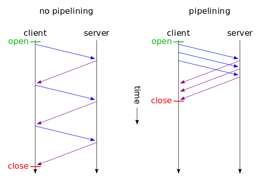

On top of the infrastructure of the internet --- or the physical network layers --- sits the Internet Protocol, as part of the TCP/IP, or transport layer. It's the fabric underlying all or most of our internet communications.

A higher level protocol layer that we use on top of this is the _application layer_. On this level, various applications use different protocols to connect and transfer information. We have SMTP, POP3, and IMAP for sending and receiving emails, IRC and XMPP for chatting, SSH for remote sever access, and so on.

The best-known protocol among these, which has become synonymous with the use of the internet, is HTTP (hypertext transfer protocol). This is what we use to access websites every day. It was devised by Tim Berners-Lee at CERN as early as 1989\. The specification for version 1.0 was released in 1996 (RFC 1945), and 1.1 in 1999.

The HTTP specification is maintained by the World Wide Web Consortium, and can be found at http://www.w3.org/standards/techs/HTTP.

The first generation of this protocol --- versions 1 and 1.1 --- dominated the web up until 2015, when HTTP/2 was released and the industry --- web servers and browser vendors --- started adopting it.

## HTTP/1

HTTP is a _stateless_ protocol, based on a _request-response_ structure, which means that the client makes requests to the server, and these requests are atomic: any single request isn't aware of the previous requests. (This is why we use cookies --- to bridge the gap between multiple requests in one user session, for example, to be able to serve an authenticated version of the website to logged in users.)

Transfers are typically initiated by the client --- meaning the user's browser --- and the servers usually just respond to these requests.

We could say that the current state of HTTP is pretty "dumb", or better, low-level, with lots of "help" that needs to be given to the browsers and to the servers on how to communicate efficiently. Changes in this arena are not that simple to introduce, with so many existing websites whose functioning depends on backward compatibility with any introduced changes. Anything being done to improve the protocol has to be done in a seamless way that won't disrupt the internet.

In many ways, the current model has become a bottleneck with this strict request-response, atomic, synchronous model, and progress has mostly taken the form of hacks, spearheaded often by the industry leaders like Google, Facebook etc. The usual scenario, which is being improved on in various ways, is for the visitor to request a web page, and when their browser receives it from the server, it parses the HTML and finds other resources necessary to render the page, like CSS, images, and JavaScript. As it encounters these resource links, it stops loading everything else, and requests specified resources from the server. It doesn't move a millimeter until it receives this resource. Then it requests another, and so on.


The number of requests needed to load world's biggest websites is often in couple of hundreds.

This includes a lot of waiting, and a lot of round trips during which our visitor sees only a white screen or a half-rendered website. These are wasted seconds. A lot of available bandwidth is just sitting there unused during these request cycles.

[CDNs](https://www.sitepoint.com/what-is-a-cdn-and-how-does-it-work) can alleviate a lot of these problems, but even they are nothing but hacks.

As Daniel Stenberg (one of the people working on HTTP/2 standardization) from Mozilla [has pointed out](https://bagder.gitbooks.io/HTTP2-explained/content/en/part2.html), the first version of the protocol is having a hard time fully leveraging the capacity of the underlying transport layer, TCP. Users who have been working on optimizing website loading speeds know this often requires some creativity, to put it mildly.

Over time, internet bandwidth speeds have drastically increased, but HTTP/1.1-era infrastructure didn't utilize this fully. It still struggled with issues like [HTTP pipelining](https://en.wikipedia.org/wiki/HTTP_pipelining) --- pushing more resources over the same TCP connection. Client-side support in browsers has been dragging the most, with Firefox and Chrome disabling it by default, or not supporting it at all, like IE, Firefox version 54+, etc. This means that even small resources require opening a new TCP connection, with all the bloat that goes with it --- TCP handshakes, DNS lookups, latency… And due to [head-of-line blocking](https://www.wikiwand.com/en/Head-of-line_blocking), the loading of one resource results in blocking all other resources from loading.



A synchronous, non-pipelined connection vs a pipelined one, showing possible savings in load time.

Some of the optimization sorcery web developers have to resort to under the HTTP/1 model to optimize their websites include [image sprites](https://developer.mozilla.org/en-US/docs/Web/CSS/CSS_Images/Implementing_image_sprites_in_CSS), CSS and JavaScript concatenation, sharding (distributing visitors' requests for resources over more than one domain or subdomain), and so on.

The improvement was due, and it had to solve these issues in a seamless, backward-compatible way so as not to interrupt the workings of the existing web.

## SPDY

In 2009, Google announced a project that would become a draft proposal of a new-generation protocol, [SPDY](https://www.chromium.org/spdy/spdy-whitepaper) (pronounced _speedy_), adding support to Chrome, and pushing it to all of its web services in subsequent years. Then followed Twitter and server vendors like Apache, nginx with their support, Node.js, and later came Facebook, WordPress.com, and most CDN providers.

SPDY introduced **multiplexing** --- sending multiple resources in parallel, over a single TCP connection. Connections are encrypted by default, and data is compressed. First, preliminary tests in the [SPDY white paper](https://www.chromium.org/spdy/spdy-whitepaper) performed on the top 25 sites showed speed improvements from 27% to over 60%.

After it proved itself in production, [SPDY version 3 became basis for the first draft of HTTP/2](https://bagder.gitbooks.io/HTTP2-explained/content/en/part4.html), made by the Hypertext Transfer Protocol working group httpbis in 2015.

HTTP/2 aims to address the issues ailing the first version of the protocol --- latency issues --- by:

*   compressing HTTP headers
*   implementing [server push](https://en.wikipedia.org/wiki/HTTP/2_Server_Push)
*   [multiplexing](https://en.wikipedia.org/wiki/Multiplexing) requests over a single connection.

It also aims to solve head-of-line blocking. The data it transfers is in [binary format, improving its efficiency](https://HTTP2.github.io/faq/#why-is-HTTP2-binary), and it requires encryption by default (or at least, this is a requirement imposed by major browsers).

Header compression is performed with the HPACK algorithm, [solving the vulnerability in SPDY](https://blog.cloudflare.com/hpack-the-silent-killer-feature-of-HTTP-2/), and reducing web **request** sizes by half.

**Server push** is one of the features that aims to solve wasted waiting time, by serving resources to the visitor's browser before the browser requires it. This reduces the round trip time, which is a big bottleneck in website optimization.

Due to all these improvements, the difference in loading time that HTTP/2 brings to the table can be seen on [this example page](https://imagekit.io/demo/HTTP2-vs-HTTP1) by imagekit.io.

Savings in loading time become more apparent the more resources a website has.

## How to See If a Website Is Serving Resources over HTTP/2

In major browsers, like Firefox or Chrome, we can check a website's support for the HTTP/2 protocol in the inspector tool, by opening the _Network_ tab and right-clicking the strip above the resources list. Here we can enable the _Protocol_ item.


Another way is to install a little JavaScript-based tool that allows us to inspect HTTP/2 support through the command line (assuming we have Node.js and npm installed):

```bash
npm install -g is-HTTP2-cli
```

After installation, we should be able to use it like this:

```bash
is-HTTP2 www.google.com

✓ HTTP/2 supported by www.google.com
Supported protocols: grpc-exp h2 HTTP/1.1
```

## Implementations

At the time of writing, all major browsers [support HTTP/2](https://en.wikipedia.org/wiki/Comparison_of_web_browsers#Protocol_support), albeit requiring all the HTTP/2 requests be encrypted, which the HTTP/2 specification itself doesn't require.

### Servers

**Apache 2.4 supports it** with its [mod_HTTP2](https://HTTPd.apache.org/docs/2.4/howto/HTTP2.html) module which should be production-ready by now. Apache needs to be built with it by adding the `--enable-HTTP2` argument to the `./configure` command. We also need to be sure to have at least version 1.2.1 of the `libngHTTP2` library installed. In the case of the system having trouble finding it, we can provide the path to `./configure` by adding `--with-ngHTTP2=<path>`.

The next step would be to load the module by adding the directive to Apache's configuration:
```
LoadModule HTTP2_module modules/mod_HTTP2.so
```
Then, we would add `Protocols h2 h2c HTTP/1.1` to our virtual host block and reload the server. Apache's documentation warns us of the caveats when enabling HTTP/2:

> Enabling HTTP/2 on your Apache Server has impact on the resource consumption and if you have a busy site, you may need to consider carefully the implications.
>
> The first noticeable thing after enabling HTTP/2 is that your server processes will start additional threads. The reason for this is that HTTP/2 gives all requests that it receives to its own **Worker** threads for processing, collects the results and streams them out to the client.

_You can read more about the Apache configuration [here](https://HTTPd.apache.org/docs/2.4/howto/HTTP2.html)._

**nginx** [has supported HTTP/2 since version 1.9.5](https://www.nginx.com/blog/nginx-1-9-5/), and we enable it by simply adding the _http2_ argument to our virtual host specification:

```
server {
    listen 443 ssl http2 default_server;

    ssl_certificate    server.crt;
    ssl_certificate_key server.key;
```

Then reload nginx.

Unfortunately, **server push** at the time of writing is not officially implemented, but [it has been added to development roadmap](https://trac.nginx.org/nginx/roadmap), scheduled to be released next year. For the more adventurous ones, there is an [unofficial nginx module](https://github.com/ghedo/HTTP2-push-nginx-module) that adds support for HTTP/2 server push.

**LiteSpeed and OpenLiteSpeed** [also boast](https://www.litespeedtech.com/products/litespeed-web-server/features/HTTP-2-support) support for HTTP/2.

One caveat **before** activating HTTP/2 on the server side is to make sure that we have SSL support. This means that all the virtual hosts snippets we mentioned above --- for Apache and for nginx --- need to go into the SSL-version virtual host blocks, listening on port 443\. Once we have Apache or nginx installed, and we have configured regular virtual hosts, getting the LetsEncrypt SSL certificate, and installing it on any of the major Linux distributions should be a matter of just couple of lines of code. [Certbot](https://certbot.eff.org/) is a command-line tool that automates the whole process.

## Conclusion

In this article, I've provided a bird's-eye overview of HTTP/2, the new and evolving specification of a second-generation web protocol.

The full list of implementations of the new generation of HTTP can be found [here](https://github.com/HTTP2/HTTP2-spec/wiki/Implementations).

For the less tech-savvy, perhaps the shortest path to transitioning to this new protocol would be to simply implement a [CDN](https://www.sitepoint.com/what-is-a-cdn-and-how-does-it-work) into the web stack, as CDNs were among the earliest adopters of HTTP/2.
