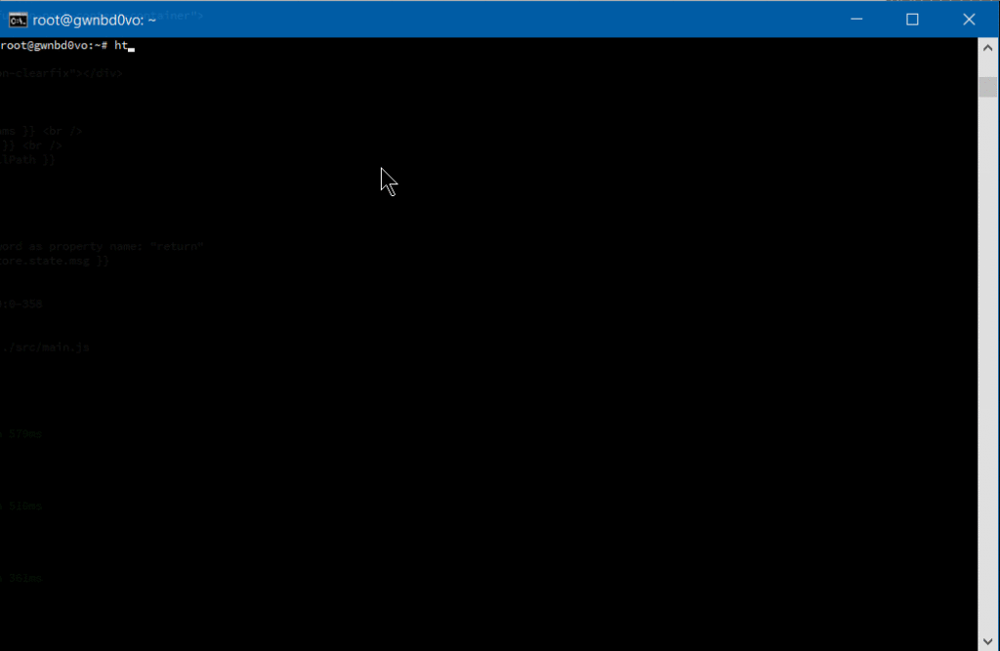
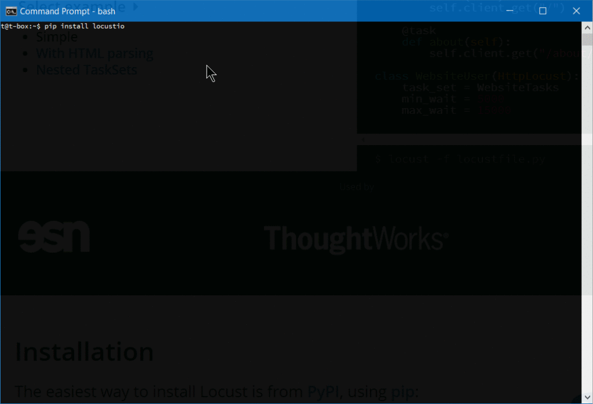
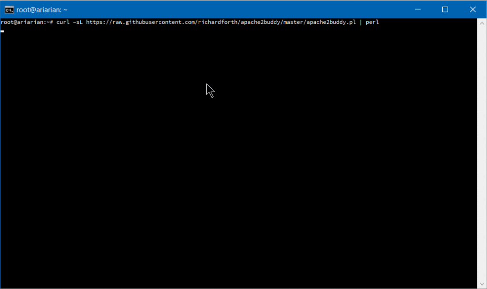

Some years ago, the [Apache Foundation's web server](https://httpd.apache.org/), known simply as "Apache", was so ubiquitous that it became synonymous with the term "web server". Its daemon process on Linux systems has the name _httpd_ (meaning simply _http process_) --- and comes preinstalled in major Linux distributions.

It was initially released in 1995, and, to [quote Wikipedia](https://en.wikipedia.org/wiki/Apache_HTTP_Server), _"it played a key role in the initial growth of the World Wide Web"_. It is still the most-used web server software [according to W3techs](https://w3techs.com/blog/entry/fact_20170828). However, according to those reports which [show some trends of the last decade](https://w3techs.com/technologies/history_overview/web_server/ms/y) and [comparisons to other solutions](https://w3techs.com/technologies/comparison/ws-apache,ws-microsoftiis,ws-nginx), its market share is decreasing. The reports given by [Netcraft](https://news.netcraft.com/archives/2017/09/11/september-2017-web-server-survey.html) and [Builtwith](https://trends.builtwith.com/web-server) differ a bit, but all agree on a trending decline of Apache's market share and the growth of Nginx.

**Nginx** --- pronounced _engine x_ --- was released in 2004 by [Igor Sysoev](https://www.wikiwand.com/en/Igor_Sysoev), with the explicit intent to outperform Apache. Nginx's website has [an article worth reading](https://www.nginx.com/blog/nginx-vs-apache-our-view/) which compares these two technologies. At first, it was mostly used as a supplement to Apache, mostly for serving static files, but it has been steadily growing, as it has been evolving to deal with the full spectrum of web server tasks.

It is often used as a [reverse proxy](https://www.nginx.com/resources/admin-guide/reverse-proxy/), [load balancer](http://nginx.org/en/docs/http/load_balancing.html), and for [HTTP caching](https://www.nginx.com/blog/nginx-caching-guide/). CDNs and video streaming providers use it to build their content delivery systems where performance is critical.

Apache has been around for a long time, and it has a [big choice of modules](https://www.wikiwand.com/en/List_of_Apache_modules). Managing Apache servers is known to be user-friendly. [Dynamic module loading](http://howtolamp.com/lamp/httpd/2.4/dso/) allows for different modules to be compiled and added to the Apache stack without recompiling the main server binary. Oftentimes, modules will be in Linux distro repositories, and after installing them through system package managers, they can be gracefully added to the stack with commands like [a2enmod](http://manpages.ubuntu.com/manpages/yakkety/man8/a2enmod.8.html). This kind of flexibility has yet to be seen with Nginx. When we look at a [guide for setting up Nginx for HTTP/2](http://nginx.org/en/docs/http/ngx_http_v2_module.html), modules are something Nginx needs to be built with --- configured for at build-time.

One other feature that has contributed to Apache's market rule is the [.htaccess file](http://www.htaccess-guide.com/). It is Apache's silver bullet, which made it a go-to solution for the shared hosting environments, as it allows controlling the server configuration on a directory level. Every directory on a server served by Apache can have its own `.htaccess` file.

Nginx not only has no equivalent solution, but [discourages](https://www.nginx.com/resources/wiki/start/topics/examples/likeapache-htaccess/) such usage due to performance hits.


_Server vendors market share 1995–2005\. [Data by Netcraft](http://www.netcraft.com/)_

[LiteSpeed](https://www.litespeedtech.com/products/litespeed-web-server), or LSWS, is one server contender that has a level of flexibility that can compare to Apache, while not sacrificing performance. It supports Apache-style `.htaccess`, `mod_security` and `mod_rewrite`, and it's worth considering for shared setups. It was planned as a drop-in replacement for Apache, and it works with cPanel and Plesk. It's been supporting HTTP/2 since 2015.

[LiteSpeed has three license tiers](https://www.hivelocity.net/kb/what-is-litespeed/), OpenLiteSpeed, LSWS Standard and LSWS Enterprise. Standard and Enterprise [come with an optional](https://www.interserver.net/tips/kb/litespeed-cache-lscache-details-advantages/) caching solution comparable to Varnish, LSCache, [which is built into the server itself](https://www.litespeedtech.com/support/wiki/doku.php/litespeed_wiki:cache), and can be controlled, with rewrite rules, in `.htaccess` files (per directory). [It also comes with some DDOS-mitigating "batteries" built in](https://www.litespeedtech.com/products/litespeed-web-server/features/anti-ddos-advances). This, along with its event-driven architecture, makes it a solid contender, targeting primarily [performance-oriented hosting providers](https://www.a2hosting.com/litespeed-hosting), but it could be worth setting up even for smaller servers or websites.

## Hardware Considerations

When optimizing our system, we cannot emphasize enough giving due attention to our hardware setup. Whichever of these solutions we choose for our setup, having enough RAM is critical. When a web server process, or an interpreter like PHP, don't have enough RAM, they start swapping, and swapping effectively means using the hard disk to supplement RAM memory. The effect of this is increased latency every time this memory is accessed. This takes us to the second point --- the hard disk space. Using fast SSD storage is another critical factor of our website speed. We also need to mind the CPU availability, and the physical distance of our server's data centers to our intended audience.

To dive in deeper into the hardware side of performance tuning, [Dropbox has a good article](https://blogs.dropbox.com/tech/2017/09/optimizing-web-servers-for-high-throughput-and-low-latency/).

## Monitoring

One practical way to monitor our current server stack performance, per process in detail, is [htop](http://hisham.hm/htop/), which works on Linux, Unix and macOS, and gives us a colored overview of our processes.



Other monitoring tools are [New Relic](https://newrelic.com/), a premium solution with a comprehensive set of tools, and [Netdata](https://my-netdata.io/), an open-source solution which offers great extensibility, fine-grained metrics and a customizable web dashboard, suitable for both little VPS systems and monitoring a network of servers. It can send alarms for any application or system process via email, Slack, pushbullet, Telegram, Twilio etc.


**[Monit](https://www.cyberciti.biz/faq/how-to-install-and-use-monit-on-ubuntudebian-linux-server/)** is another, headless, open-source tool which can monitor the system, and can be configured to alert us, or restart certain processes, or reboot the system when some conditions are met.

## Testing the System

[AB](https://httpd.apache.org/docs/2.4/programs/ab.html) --- Apache Benchmark --- is a simple load-testing tool by Apache Foundation, and [Siege](https://www.joedog.org/siege-home/) is another load-testing program. This [article](https://kalamuna.atlassian.net/wiki/spaces/KALA/pages/16023587/Testing+With+Apache+Benchmark+and+Siege) explains how to set them both up, and [here](https://blog.getpolymorph.com/7-tips-for-heavy-load-testing-with-apache-bench-b1127916b7b6) we have some more advanced tips for AB, while an in-depth look at Siege can be found [here](https://www.sitepoint.com/web-app-performance-testing-siege-plan-test-learn/).

If you prefer a web interface, there is [Locust](https://locust.io/), a Python-based tool that comes in very handy for testing website performance.



After we install Locust, we need to [create a locustfile](https://docs.locust.io/en/latest/writing-a-locustfile.html) in the directory from which we will launch it:

```python
    from locust import HttpLocust, TaskSet, task

    class UserBehavior(TaskSet):
        @task(1)
        def index(self):
            self.client.get("/")

        @task(2)
        def shop(self):
            self.client.get("/?page_id=5")

        @task(3)
        def page(self):
            self.client.get("/?page_id=2")

    class WebsiteUser(HttpLocust):
        task_set = UserBehavior
        min_wait = 300
        max_wait = 3000
```

Then we simply launch it from the command line:

```bash
    locust --host=https://my-website.com
```

One warning with these load-testing tools: they have the effect of a DDoS attack, so it's recommended you limit testing to your own websites.

## Tuning Apache

### Apache's mpm modules

Apache dates to 1995 and the early days of the internet, when an accepted way for servers to operate was to spawn a new process on each incoming TCP connection and to reply to it. If more connections came in, more worker processes were created to handle them. The costs of spawning new processes were high, and Apache developers devised a _prefork_ mode, with a pre-spawned number of processes. Embedded dynamic language interpreters within each process (like [mod_php](https://stackoverflow.com/questions/2712825/what-is-mod-php)) were still costly, and [server crashes](https://serverfault.com/questions/823121/why-is-apache-spawning-so-many-processes/823162) with Apache's default setups became common. Each process was only able to handle a single incoming connection.

This model is known as _[mpm_prefork_module](http://httpd.apache.org/docs/2.4/mod/prefork.html)_ within Apache's [MPM](https://httpd.apache.org/docs/trunk/mpm.html#dynamic) (Multi-Processing Module) system. [According to Apache's website](http://httpd.apache.org/docs/2.4/mod/prefork.html), this mode requires little configuration, because it is self-regulating, and _most important is that the `MaxRequestWorkers` directive be big enough to handle as many simultaneous requests as you expect to receive, but small enough to ensure there's enough physical RAM for all processes_.


_A small Locust load test that shows spawning of huge number of Apache processes to handle the incoming traffic._

We may add that this mode is maybe the biggest cause of Apache's bad name. It can get resource-inefficient.

Version 2 of Apache brought another two MPMs that try to solve the issues that _prefork_ mode has. These are [_worker module_](http://httpd.apache.org/docs/2.4/mod/worker.html), or _mpm_worker_module_, and [_event module_](http://httpd.apache.org/docs/2.4/mod/event.html).

Worker module is not process-based anymore; it's a hybrid process-thread based mode of operation. Quoting [Apache's website](http://httpd.apache.org/docs/2.4/mod/worker.html),

> a single control process (the parent) is responsible for launching child processes. Each child process creates a fixed number of server threads as specified in the `ThreadsPerChild` directive, as well as a listener thread which listens for connections and passes them to a server thread for processing when they arrive.

This mode is more resource efficient.

2.4 version of Apache brought us the third MPM --- [event module](http://httpd.apache.org/docs/2.4/mod/event.html). It is based on worker MPM, and added a separate listening thread that manages dormant keepalive connections after the HTTP request has completed. It's a non-blocking, asynchronous mode with a smaller memory footprint. More about version 2.4 improvements [here](https://www.slideshare.net/jimjag/apachecon-2017-whats-new-in-httpd-24).

We have loaded a testing WooCommerce installation with around 1200 posts on a virtual server and tested it on Apache 2.4 with the default, prefork mode, and mod_php.

First we tested it with [libapache2-mod-php7](https://packages.debian.org/sid/amd64/libapache2-mod-php7.0) and mpm_prefork_module at https://tools.pingdom.com:


Then, we went for testing the event MPM module.

We had to add `multiverse` to our `/etc/apt/sources.list`:

```bash
deb http://archive.ubuntu.com/ubuntu xenial main restricted universe multiverse
deb http://archive.ubuntu.com/ubuntu xenial-updates main restricted universe multiverse
deb http://security.ubuntu.com/ubuntu xenial-security main restricted universe multiverse
deb http://archive.canonical.com/ubuntu xenial partner
```

Then we did `sudo apt-get update`and installed `libapache2-mod-fastcgi` and php-fpm:

```bash
sudo apt-get install libapache2-mod-fastcgi php7.0-fpm
```

Since php-fpm is a service separate from Apache, it needed a restart:

```bash
sudo service start php7.0-fpm
```

Then we disabled the prefork module, and enabled the event mode and proxy_fcgi:

```bash
sudo a2dismod php7.0 mpm_prefork
sudo a2enmod mpm_event proxy_fcgi
```

We added this snippet to our Apache virtual host:

```cnf
&lt;filesmatch "\.php$"&gt;
    SetHandler "proxy:fcgi://127.0.0.1:9000/"
&lt;/filesmatch&gt;
```

This port needs to be consistent with php-fpm configuration in `/etc/php/7.0/fpm/pool.d/www.conf`. More about the php-fpm setup [here](https://wiki.apache.org/httpd/PHP-FPM).

Then we tuned the mpm_event configuration in `/etc/apache2/mods-available/mpm_event.conf`, keeping in mind that our mini-VPS resources for this test were constrained --- so we merely reduced some default numbers. Details about every directive on Apache's [website](http://httpd.apache.org/docs/current/mod/mpm_common.html), and tips specific to the event mpm [here](http://httpd.apache.org/docs/2.4/mod/event.html). Keep in mind that started _servers_ consume an amount of memory regardless of how busy they are. The `MaxRequestWorkers` directive sets the limit on the number of simultaneous requests allowed: setting `MaxConnectionsPerChild` to a value other than zero is important, because it prevents a possible memory leak.

```cnf
<ifmodule mpm_event_module>
        StartServers              1
        MinSpareThreads          30
        MaxSpareThreads          75
        ThreadLimit              64
        ThreadsPerChild          30
        MaxRequestWorkers        80
        MaxConnectionsPerChild   80
</ifmodule>
```

Then we restarted the server with `sudo service apache2 restart` (if we change some directives, like ThreadLimit, we will need to stop and start the service explicitly, with `sudo service apache2 stop; sudo service apache2 start`).

Our tests on [Pingdom](https://tools.pingdom.com) now showed page load time reduced by more than half:


### Other tips for tuning Apache:

**Disabling .htaccess**: htaccess allows setting specific configuration for every single directory in our server root, without restarting. So, traversing all the directories, looking for the .htaccess files, on every request, incurs a performance penalty.

Quote from the Apache docs:

> In general, you should only use `.htaccess` files when you don’t have access to the main server configuration file.* … in general, use of `.htaccess` files should be avoided when possible. Any configuration that you would consider putting in a `.htaccess` file, can just as effectively be made in a `<directory>` section in your main server configuration file.*

The solution is to disable it in `/etc/apache2/apache2.conf`:

```cnf
AllowOverride None
```

If we need it for the specific directories, we can then enable it within sections in our virtual host files:

```cnf
AllowOverride All
```

Further tips include:

*   **[Control the browser cache with mod_expires](http://httpd.apache.org/docs/current/mod/mod_expires.html)** --- by setting the expires headers.

*   Keep **HostNameLookups** turned off --- `HostNameLookups Off` is the default since Apache 1.3, but make sure it stays off, because it can incur a performance penalty.

*   **Apache2buddy** is a simple script that we can run and get tips for tuning our system: `curl -sL https://raw.githubusercontent.com/richardforth/apache2buddy/master/apache2buddy.pl | perl`



## Nginx

Nginx is an [event-driven](https://www.nginx.com/blog/inside-nginx-how-we-designed-for-performance-scale/) and non-blocking web server. To quote one poster [on Hacker News](https://news.ycombinator.com/item?id=8343350),

> Forking processes is incredibly expensive compared to an event loop. Event-based HTTP servers inevitably won.

This statement sparked quite a debate on Hacker News, but from our experience, just switching from a mpm_prefork Apache to Nginx can often mean saving the website from crashing. Simple switching to Nginx is very often a cure in itself.


A more thorough visual explanation of Nginx architecture can be found [here](https://www.nginx.com/resources/library/infographic-inside-nginx/).

### Nginx settings

Nginx recommends pinning the number of workers to number of PC cores (just like we did with Apache's mpm_event configuration), by setting `worker_processes` to `auto` (default is 1) in `/etc/nginx/nginx.conf`.

`worker_connections` sets the number of connections every worker process can handle. The default is 512, but it can usually be increased.

**[Keepalive connections](https://en.wikipedia.org/wiki/Keepalive)** are a server aspect that impacts performance, which [isn't usually visible in benchmarks](https://www.nginx.com/blog/http-keepalives-and-web-performance/).


[According to the Nginx website](https://www.nginx.com/blog/http-keepalives-and-web-performance/),

> HTTP keepalive connections are a necessary performance feature that reduce latency and allow web pages to load faster.

Establishing new TCP connections [can be costly](https://en.wikipedia.org/wiki/Handshaking) --- not to mention when there is _HTTPS_ encryption involved. The [HTTP/2](https://http2.github.io/) protocol mitigates this with its [multiplexing features](https://en.wikipedia.org/wiki/Multiplexing). Reusing an existing connection can reduce request times.

Apache's mpm_prefork and mpm_worker suffer from concurrency limitations that contrast the keepalive event loop. This is somewhat fixed in Apache 2.4, in mpm_event module, and comes as the only, default mode of operation in Nginx. Nginx workers can handle thousands of incoming connections simultaneously, and if it's used as a reverse proxy or a load balancer, Nginx then uses a local pool of keepalive connections, without TCP connection overhead.

[`keepalive_requests`](http://nginx.org/en/docs/http/ngx_http_core_module.html?&_ga=2.26969269.942121935.1510206018-994710012.1508256997#keepalive_requests) is a setting that regulates the number of requests a client can make over a single keepalive connection. [`keepalive_timeout`](http://nginx.org/en/docs/http/ngx_http_core_module.html?&_ga=2.191644834.942121935.1510206018-994710012.1508256997#keepalive_timeout) sets the time an idle keepalive connection stays open.

[`keepalive`](http://nginx.org/en/docs/http/ngx_http_upstream_module.html?&_ga=2.203640216.942121935.1510206018-994710012.1508256997#keepalive) is a setting pertaining to an Nginx connection to an upstream server --- when it acts as a proxy or load balancer. This means the number of idle keepalive upstream connections per worker process.

Enabling the upstream keepalive connections requires putting these directives into the Nginx main configuration:

```cnf
proxy_http_version 1.1;
proxy_set_header Connection "";
```

Nginx upstream connections are managed by [ngx_http_upstream_module](http://nginx.org/en/docs/http/ngx_http_upstream_module.html).

If our front-end application keeps polling our back-end application for updates, increasing the `keepalive_requests` and `keepalive_timeout` will limit the number of connections that need to be established. The `keepalive` directive shouldn't be too large, to allow for other connections to reach our upstream server.

The tuning of these settings is done on a per-case basis, and needs to be tested. That is maybe one reason why `keepalive` doesn't have a default setting.

#### Using unix sockets

By default, Nginx uses a separate PHP process to which it forwards PHP file requests. In this, it acts as a proxy (just like Apache when we set it up with php7.0-fpm).

Often our virtual host setup with Nginx will look like this:

```cnf
location ~ \.php$ {
    fastcgi_param REQUEST_METHOD $request_method;
    fastcgi_param SCRIPT_FILENAME $document_root$fastcgi_script_name;
    fastcgi_pass 127.0.0.1:9000;
}
```

Since FastCGI is a different protocol from HTTP, the first two lines are forwarding some arguments and headers to php-fpm, while the third line specifies the way to proxy our request --- over a local network socket.

This is practical for multi-server setups, since we can also specify remote servers to proxy requests to.

But if we're hosting our whole setup on a single system, we should use a Unix socket to connect to the listening php process:

```cnf
fastcgi_pass unix:/var/run/php7.0-fpm.sock;
```

Unix sockets are [considered to have better performance than TCP](https://stackoverflow.com/questions/257433/postgresql-unix-domain-sockets-vs-tcp-sockets/257479#257479), and this setup is considered safer. You can find more details about this setup in this [article by Rackspace](https://support.rackspace.com/how-to/install-nginx-and-php-fpm-running-on-unix-file-sockets/).

This tip regarding Unix sockets is also applicable for Apache. More details [here](https://wiki.apache.org/httpd/PHP-FPM).

**gzip_static**: the accepted wisdom around web server performance is to compress our static assets. This often means we'll try to compromise, and try to compress only files that are above some threshold, because compressing resources on the fly, with every request, can be expensive. Nginx has a `gzip_static` directive that allows us to serve gzipped versions of files --- with extension .gz --- instead of regular resources:

```cnf
location /assets {
    gzip_static on;
}
```

This way, Nginx will try to serve `style.css.gz` instead of `style.css` (we need to take care of the gzipping ourselves, in this case).

This way, the CPU cycles won't be wasted through on-the-fly compression for every request.

### Caching with Nginx

The story about Nginx wouldn't be complete without mentioning how to cache content. Nginx caching is so efficient that many sysadmins don't think that separate layers for [HTTP caching](https://en.wikipedia.org/wiki/Web_cache) --- like [Varnish](https://varnish-cache.org/) --- make much sense. Perhaps it is less elaborate, but _[simplicity is a feature](https://speakerdeck.com/lukasa/simplicity-is-a-feature)._ Enabling caching with Nginx is rather simple.

```cnf
proxy_cache_path /path/to/cache levels=1:2 keys_zone=my_cache:10m max_size=10g
    inactive=60m;
```

This is a directive we place in our virtual host file, **outside** of the `server` block. The `proxy_cache_path` argument can be any path we want to store our cache. `levels` designates how many levels of directories Nginx should store cached content in. For performance reasons, two levels are usually okay. Recursing through the directories can be costly. The `keys_zone` argument is a name for a shared memory zone used for storing the cache keys, and `10m` is room for those keys in memory (10MB is usually enough; this isn't the room for actual cached content). `max_size` is optional, and sets the upper limit for the cached content --- here 10GB. If this isn't specified, it will take up all the available space. `inactive` specifies how long the content can stay in the cache without being requested, before it gets deleted by Nginx.

Having set this up, we would add the following line, with the name of our memory zone to either `server` or `location` block:

```cnf
proxy_cache my_cache;
```

An extra layer of fault-tolerance with Nginx can be achieved by telling it to serve the items from cache when it encounters a server error on the origin, or the upstream server, or when the server is down:

```cnf
proxy_cache_use_stale error timeout http_500 http_502 http_503 http_504;
```

More details about the `server` or `location` block directives to further tune Nginx caching can be found [here](https://www.nginx.com/blog/nginx-caching-guide/).

`proxy_cache_*` directives are for static assets, but we usually want to cache the dynamic output of our web apps --- whether it's a CMS or something else. In this case, we'll use the `fastcgi_cache_*` directive instead of `proxy_cache_*`:

```cnf
fastcgi_cache_path /var/run/nginx-cache levels=1:2 keys_zone=my_cache:10m inactive=60m;
fastcgi_cache_key "$scheme$request_method$host$request_uri";
fastcgi_cache_use_stale error timeout invalid_header http_500;
fastcgi_ignore_headers Cache-Control Expires Set-Cookie;
add_header NGINX_FASTCGI_CACHE $upstream_cache_status;
```

The last line above will set response headers to inform us whether the content was delivered from the cache or not.

Then, in our server or location block, we can set some exceptions to caching --- for example, when the query string is present in the request URL:

```cnf
if ($query_string != "") {
    set $skip_cache 1;
}
```

Also, in our `\.php` block, inside `server`, in case of PHP, we would add something like:

```cnf
location ~ \.php$ {
    try_files $uri =404;
    include fastcgi_params;

    fastcgi_read_timeout 360s;
    fastcgi_buffer_size 128k;
    fastcgi_buffers 4 256k;
    fastcgi_param SCRIPT_FILENAME $document_root$fastcgi_script_name;

    fastcgi_pass unix:/run/php/php7.0-fpm.sock;

        fastcgi_index index.php;
        fastcgi_cache_bypass $skip_cache;
        fastcgi_no_cache $skip_cache;
        fastcgi_cache my_cache;
        fastcgi_cache_valid  60m;
}
```

Above, the `fastcgi_cache*` lines, and `fastcgi_no_cache`, regulate caching and exclusions. Detailed reference of all these directives can be found [on the Nginx docs website](http://nginx.org/en/docs/dirindex.html).

To learn more, the people over at Nginx have provided a [free webinar](https://www.nginx.com/resources/webinars/installing-tuning-nginx/) on this topic, and there's a [number of ebooks](https://www.nginx.com/resources/library/) available.

## Conclusion

We've tried to introduce some techniques that will help us improve our web server's performance, and the theory behind those techniques. But this topic is in no way exhausted: we still haven't covered reverse-proxy setups that consist of both Apache and Nginx, or multi-server setups. Achieving the top results with both these servers is a matter of testing and analyzing specific, real-life cases. It's kind of a never-ending topic.
