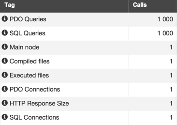
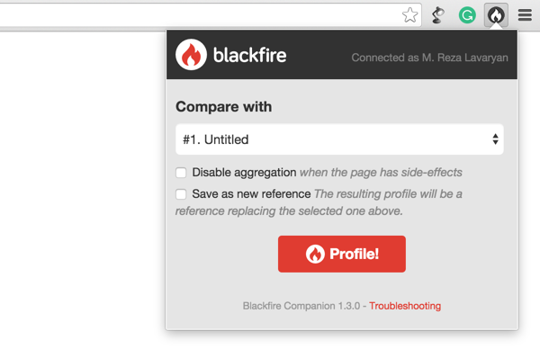
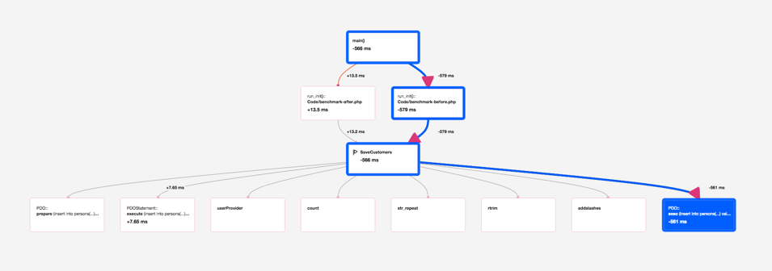
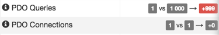

No one hates robust and scalable applications, especially when the database is growing quickly, and millions of requests need to be served on a daily basis. Profiling is a form of program analysis to measure the time and resources consumed by the program. With profiling, we can spot the performance bottlenecks in the code and do something about them. There is a variety of profiling tools out there, each taking a different approach.


There are two main types of profiling methods: **Sampling** and **Instrumentation**.

In the sampling approach, the profiler takes samples of the **call stack** or the **Memory** at certain intervals, and updates its statistics. This method has a lesser effect on performance because it doesn’t modify the code at all. However, sampling has its overhead, which can be tuned by increasing the sampling frequency.

In the instrumentation approach, profiling instructions are inserted into the code either by the programmer or automatically by the profiler (at bytecode level). This approach has a significant performance impact on the application but provides precise details of what exactly is happening in the code at runtime.

[Blackfire.io](https://blackfire.io/) is the new generation of web profilers, which takes the automatic instrumentation approach, but without imposing a performance impact on our application. It’s been developed by [Sensio Labs](https://sensiolabs.com/), the team behind the [Symfony Framework](http://sitepoint.com/tag/symfony).

What makes Blackfire special is that it helps us **continuously** test our application’s performance without adding a single line of code.

We can profile any PHP script using its fancy Google Chrome extension, or its command line tool.

Blackfire is easy to install as it is supported by many cloud server providers and VM boxes, including Homestead. In this tutorial, we’re going to learn how we can use Blackfire to build faster applications. As usual, we’ll use [Homestead Improved](http://www.sitepoint.com/quick-tip-get-homestead-vagrant-vm-running/) to set up our development environment.

## Getting Started

Once the VM is booted up and we’ve managed to ssh into the system using `vagrant ssh`, we can actually start using Blackfire!

But wait, first we need to create a Blackfire account [here](https://blackfire.io/signup). If we already have one, we can proceed by putting our Blackfire credentials inside `homestead.yaml` file, which is located in the root directory of our Vagrant box.

To get our Blackfire credentials, we log in to [Blackfire](http://blackfire.io), click on the profile photo at top right side of the page, and click on [My Credentials](https://blackfire.io/account/credentials).

The credentials are divided into two categories: `Client Credentials` and `Server Credentials`.


We need to uncomment the Blackfire settings in our `Homestead.yaml` file and put the credentials into place:

**homestead.yml**

```
blackfire:
    - id: "Server Id here"
        token: "Server token here"
        client-id: "Client Id here"
        client-token: "Client token here"
```

## Building Blocks of Blackfire

Blackfire is made of five main components:

*   **The Probe** is a PHP extension, which instruments the application and collects the performance related information (currently works on **Linux** and **macOS**)
*   **The Agent** is a server-side daemon that aggregates and forwards the profile information to [Blackfire](http://blackfire.io).
*   **The Companion** is Google Chrome extension used to run the profiler from the browser; it can be installed from [this URL](https://blackfire.io/docs/integrations/chrome).
*   **The Client** is the command line equivalent of the Companion, which we use to profile APIs, web services, web pages, etc.
*   **The Web-based Interface** compares and visualizes the profile information in graph diagrams and tabular formats.

> The Probe, the Agent, the Client are pre-installed if we’re using the Homestead Improved Vagrant box.

## Some Terms to Know before We Start

*   **Reference Profile:** We usually need to run our first profile as a **reference profile**. This profile will be the performance **baseline** of our application. We can compare any profile with the reference, to measure the performance achievements.

*   **Exclusive Time:** The amount of time spent on a function/method to be executed, without considering the time spent for its external calls.

*   **Inclusive Time:** The total time spent to execute a function including all the external calls.

*   **Hot Paths:** Hot Paths are the parts of our application that were most active during the profile. These could be the parts that consumed more memory or took more CPU time.

## Profiling a Script

In this section, let’s profile a simple PHP script to see how fast or slow it is. To have realistic profile results, we’re going to write a small PHP script which contains database interactions and function calls. The script inserts 1,000 rows of random user data to a database table.

### Generating Dummy Data

To generate the dummy data, we use [Faker](https://github.com/fzaninotto/Faker), a handy library to generate random data about almost anything. Inside the VM and inside the project folder, we install it by executing:

```bash
composer require fzanintto/faker
```

Next, we create a data provider script which populates a JSON file with dummy data. We’ll use this JSON file within our main PHP script.

Why aren't we doing this in our main script? If we use `Faker` within our main script, the profile result will also include all the operations of `Faker` library. This will make our profile analysis more complicated, while we need something more bare-bones for this tutorial.

We name the file `UserProviderJSON.php`:

```php
<?php

require_once('vendor/autoload.php');

$num = isset($_GET['num']) ? $_GET['num'] : 1000;
$data = [];

$faker = Faker\Factory::create();

if(!file_exists('data')) {
    mkdir('data');
}

for ($i = 0; $i < $num; $i++) {
    $data[] = ['name' => $faker->name, 'email' => $faker->email, ⤶
        'city' => $faker->city,];
}

file_put_contents('data/users.json', json_encode($data));

echo 'JSON file generated.';
```

The data provider script consists of a function which generates an array of dummy data, converts the array to JSON format, and saves it as a file.

We can then run the data provider script with `php UserProviderJSON.php`.

As a result, a file named `users.json` will be created within `data` directory of our project’s root directory. This file should contain 1,000 entries of random user information in JSON format.

### Setting up the MySQL Database

If everything has gone well so far, we can create the MySQL database to store the data.

Then, we run MySQL’s command-line client:

```bash
mysql -h localhost -u homestead -psecret
```

Now, we create a database called `blackfire_tutorial`:

```mysql
CREATE DATABASE blackfire_tutorial;
USE blackfire_tutorial;
```

And the table:

```mysql
CREATE TABLE IF NOT EXISTS `sample_users` (
    `id` int(11) NOT NULL,
    `name` varchar(255) DEFAULT NULL,
    `email` varchar(255) DEFAULT NULL,
    `city` varchar(255) DEFAULT NULL
) ENGINE=InnoDB DEFAULT CHARSET=utf8;
```

### Writing the Main Script

Let’s name it `benchmark-before.php`:

```php
<?php

$db = new PDO('mysql:host=localhost;dbname=blackfire_tutorial;charset=utf8', ⤶
    'homestead', 'secret');

function SaveCustomers ($db) {

    // Providing data
    $users = userProvider();

    for ($i = 0; $i < count($users); $i++) {

        foreach($users[$i] as $key => $value) {
            $$key = addslashes($value);
        }

        $db->exec("INSERT INTO sample_users (name, email, city) VALUES ⤶
            ('$name', '$email', '$city')");

    }
}

function userProvider () {

    return json_decode(file_get_contents('data/users.json'), true);

}

// Storing data
saveCustomers($db);
echo 'Users imported successfully.';
```

In the preceding code, we create a function named `saveCustomers()`, which accepts a PDO object as the argument. `saveCustomers()` calls `userProvider()` to load the contents of `data/users.json` into an array.

Consequently, it iterates over the array’s elements and inserts them into the database one by one.

To run the script, we access it via the `/benchmark-before.php` relative URL. If everything is in order, the MySQL table will be filled with one thousand rows of random user information.

To check if the operation was successful:

```sql
mysql -h localhost -u homestead -psecret
use blackfire_tutorial;
select count(id) as rows from sample_users;
```

The expected output should be as follows:

```bash
    +-------+
    | rows  |
    +-------+
    | 1000  |
    +-------+
    1 row in set (0.01 sec)
```

### Running the First Profile

We will profile the script at its current state and set it as the **reference profile**, then we’ll do some micro-optimizations and run the profile again.

To profile the page, on the `benchmark-before.php` page, we click on the Blackfire icon in the browser toolbar. Then in `Compare With` select box, we select `Create New Reference` and click on `Profile`.


_Note: To use Companion Chrome Extension, first, we need to make sure we’re logged into [Blackfire.io](http://blackfire.io)._

If everything is properly set up, we should see the Blackfire toolbar at the top of the page.

To see the profile details, we click on `View profile`, on the right side of the Blackfire toolbar.

### Analyzing the Profile Information

After clicking on `View profile`, we’ll be redirected to the web interface, where we can find all the details about this profile run:


The web interface consists of several parts:

#### Toolbar

The toolbar contains a summary of the profile information including wall time, I/O time, memory usage, CPU time, etc. For our first profile, the toolbar contains the following information:


```
    | Wall Time | I/O    | CPU Time | SQL Queries      |
    |-----------|--------|----------|------------------|
    | 578 ms    | 541 ms | 36.8 ms  | 556 s / 1000 rq  |
```

#### Call Graph Diagram

This section visualizes the execution flow of our code in a graph. Each node in the graph represents a function/method in our application with the amount of time it took to execute.


All **nodes** in the graph are color-coded. The rule is simple: **The darker this red color is, the more active this node is during each request.**

Colored borders show the application’s **hot paths** (the parts of our application that were most active during the profile) while the colored backgrounds show the most **intense** nodes. In many cases, hot paths don’t imply a performance bottleneck as some routines normally do the heavy lifting in our application. However, it is a good place to start when trying to locate the bottlenecks.

By having a quick glance at the graph, we can spot the most active nodes. In our case, `saveCustomers()` has used **99.27%** (including external calls) of the total time.

**PDO::exec** (called by `saveCustomers()`) is the most intense node in the graph, as we’ve called this method one thousand times from `saveCustomers()`. It has taken **92.56%** of the total time spent, according to the graph!

#### Functions List


By clicking on each node, we can see all the details about it (on the left panel) including the number of calls and spent time.

As an example, we click on the `saveCustomers()` node. According to the screenshot above, we can see that this function has been called **once** (1 caller), and it has four **callees** (external function/method calls).

There are also several horizontal bar charts, showing the inclusive/exclusive times for this node in each **dimension** (wall time, I/O time, Memory, CPU time, etc.). The darker shade shows the exclusive time while the lighter shade shows the inclusive time. If we move the mouse over the bars, we can see the time/percentage for each of these dimensions.

We can also see the **caller(s)** of this function by clicking on the button underneath the **1 Callers (1 calls)** label.

If we scroll a bit down, we can also see the **callee(s)**. Above the **4 callees** label, there are several buttons next to each other with **different** widths. By clicking on each of these buttons, we’ll see the performance information for each external call from `saveCustomer()`. For instance, `userProvider()` is one of the callees of `saveCustomers()` .


#### Blackfire Metrics

Blackfire provides some metrics out of the box allowing us to evaluate our application’s performance from other perspectives as well, like SQL queries, PDO connections, HTTP response size, the number of compiled and executed files, just to name a few.



These metrics can be used in continuous performance testing. We’ll get to that shortly.

### Optimizing the Existing Code

Okay, now let’s do some micro-optimizations on the existing script to improve the performance a bit. In the existing code, we’re making one database request per entry, meaning 1,000 database interactions during each request. What if we could reduce this number to only **one** request? Consider the following statement:

```mysql
INSERT INTO persons (name, email, city) VALUES (?, ?, ?),(?, ?, ?),(?, ?, ?),(?, ?, ?)⤶
...(?, ?, ?)
```

In the above statement, all the values are concatenated as groups of parentheses (separated by commas). This statement will obviously use more memory, but will be much faster than the existing one. Let’s see it in action:

```php
<?php

$db = new PDO('mysql:host=localhost;dbname=blackfire_tutorial;charset=utf8', ⤶
'homestead', 'secret');

function SaveCustomers($db) {

    // Providing data
    $users = userProvider();

    $params = [];
    $num = count($users);
    $placeholders = rtrim(str_repeat('(?, ?, ?), ', $num), ', ');

    for ($i = 0; $i < $num; $i++) {

        $params[] = $users[$i]['name'];
        $params[] = $users[$i]['email'];
        $params[] = $users[$i]['city'];

    }

    $q = $db->prepare('INSERT INTO sample_users (name, email, city) VALUES ' ⤶
    . $placeholders);
    $q->execute($params);

    unset($params);
    unset($placeholders);
}

function userProvider () {

    return json_decode(file_get_contents('data/users.json'), true);

}

//Saving data
saveCustomers($db);
echo 'Users imported successfully.';
```

We call this file `benchmark-after.php` and run it in the browser. Now, we run the profiler again. This time in the **Compare with** select box, we choose our reference profile.



When the profiling is done, we click on `View Comparisons` to go to the web interface.


As we can see, the web interface is a bit different now since we’re comparing two different profiles. By taking a quick look at the toolbar, we can see that the wall time has been significantly optimized by **98%** (from **578 ms** to **14 ms**) and the number of database requests is reduced to only one! The memory usage has been increased by **97%** though (2.42 MB).

If the performance has been increased when compared to the reference profile, respective values on the toolbar should be colored in green. Red means the performance has been reduced (in our case the Memory usage):

```
    | Wall Time | I/O    | CPU Time | Memory | SQL Queries      |
    |-----------|--------|----------|--------|------------------|
    |   -98%    |  -98%  |   -89%   |  +117% |  -99% / -999 rq  |
```

The toolbar’s information in the second profile run displays percentage differences (between the current profile and the reference). To see the information of the current profile, toggle the `Delta` switch in right side of the toolbar:


By looking at the graph, we can also see that the performance has improved. The nodes in this diagram are colored blue. The negative value in each node means the amount of time we have saved.



In our case **PDO::exec** has been impacted most (time reduced by 555 ms). By clicking the node, we can see its details in the left pane. The performance information of this profile and the reference profile are displayed **side by side**.

By clicking on the metric tab, we can see the improvements from other perspectives. For example, in our last profile run, the `PDO Queries` has been reduced to only one.



Well, this wasn’t a lesson in performance tuning, but good enough to scratch the surface of Blackfire.

## Using the Command Line Interface

Along with the Companion, Blackfire provides a nifty command line utility called `blackfire` allowing us to profile any PHP script including web pages, web services, API calls or command-line scripts right from the terminal.

### Profiling HTTP Requests

To profile a web page from the command line, we use the `curl` sub-command followed by the page URL:

```bash
blackfire curl http://192.168.10.10/benchmark-before.php
```

As a result, Blackfire outputs some performance related information along with the URL to the web interface:

```
Profile URL: https://blackfire.io/profiles/b8fceed1-06be-4a0f-b28f-7841457e0837/graph
    Total time:   628 ms
    CPU time:    74 ms
            I/O:   554 ms
        Memory:  1.23 MB
        Network:      n/a
            SQL:   570 ms  1000 rq
```

To have more precise results, we can take several **samples** of the same request by passing the `--sample` option, followed by the number of samples that we want. Blackfire takes 10 samples by default so don’t be surprised if your database table contains 11,000 rows after the first profile run.

```bash
blackfire --sample 15 curl http://192.168.10.10/benchmark-before.php
```

We can also create a new reference profile just the way we did using Companion:

```bash
blackfire --new-reference curl http://192.168.10.10/benchmark-before.php
```

Or compare it against a previously created reference profile. To do this, we pass `--reference` followed by the reference profile id:

```bash
blackfire --reference=7  curl http://192.168.10.10/benchmark-after.php
```

_The reference profile id is available in the web interface, or as part of the profile output when using `--new-reference` option._

### Profiling CLI Scripts

By using the `blackfire` utility, we can profile any command-line script as well. This is possible via the `run` sub-command:

```bash
blackfire run php benchmark-before.php
```

All the options used with the `curl` sub-command can also be used with `run`.

## Performance Tests

Another great feature of Blackfire is its continuous performance testing. As mentioned earlier, Blackfire provides a variety of metrics out of the box which we can use to write performance tests. This feature is only available to premium users, but it is also available as a two-week trial. Assertions can be on time dimensions or other dimensions like the number of database requests, memory usage or response size.

All the tests should be in `.blackfire.yml` within our project’s root directory.

A Blackfire test is like the following code:

```yml
tests:
    "Pages should be fast enough":
        path: "/benchmark-before.php" # run the assertions for all HTTP requests
        assertions:
            - "main.wall_time < 100ms" # wall clock time is less than 100ms
```

As we can see, all the tests should be under the `tests` main key.

A test is composed of the following components:

*   A name (in the above example: **Pages should be fast enough**)
*   A regular expression (path) that all HTTP request must **match**, for the test to be executed.
*   A set of **assertions** which consist of **metrics** and **assertion values**.

Each time the profiler is run for a project containing the `.blackfire.yml` file, Blackfire automatically runs all the tests and reflects the result in the web interface (**Assertion** tab in the left panel).


In the above example, the test is run for `benchmark-before.php`. `main.wall_time` is a Blackfire metric for the total time required to execute the script. In the above assertion, we check if it’s less than `100ms`:

Here’s another example with more assertions from [Blackfire’s documentation](https://blackfire.io/docs/cookbooks/tests):

```yml
tests:
    "Homepage should not hit the DB":
        path: "/"     # only apply the assertions for the homepage
        assertions:
            - "metrics.sql.queries.count == 0"      # no SQL statements executed
            - "main.peak_memory < 10mb"             # memory does not exceed 10mb
            - "metrics.output.network_out < 100kb"  # response size is less than 100kb
```

The above test is run for the home page (`/`). In the assertions, we make sure that no database request is made on the home page, memory usage does not exceed `10 MB` and the response size is less than `100 KB`.

To learn more about assertions, refer to the [Assertion reference](https://blackfire.io/docs/reference-guide/assertions).

We can also have **custom metrics** in our assertions, which is fully covered in the [documentation](https://blackfire.io/docs/reference-guide/metrics#metrics-custom-metrics).

_Note: to validate the tests, we can use Blackfire’s [Validator](https://blackfire.io/docs/validator)._

## Wrapping Up

[Blackfire.io](http://blackfire.io) is a powerful web profiler which instruments applications without adding a single line of code. It consists of five main components: the Probe, The Agent, The Companion, CLI tool and the web interface. The Probe and the Agent are responsible for instrumenting the code and forwarding the profile results to the Blackfire server.

We can profile an application either by using Companion or `blackfire` command line utility.

Blackfire provides a web interface which visualizes the details of the profile result. We can set a profile as a reference, and then use that as a performance baseline to compare against future profiles.
