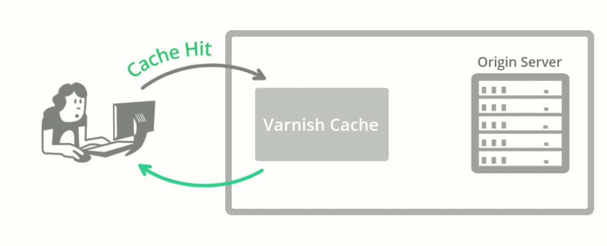
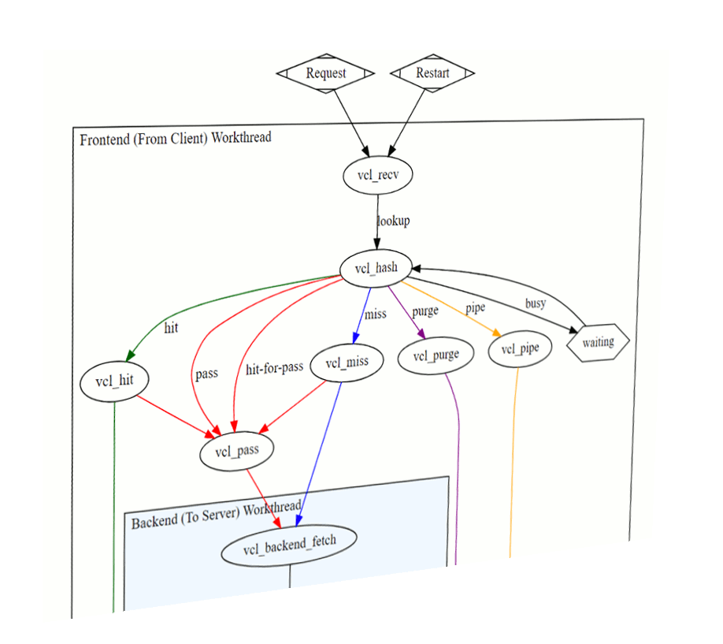
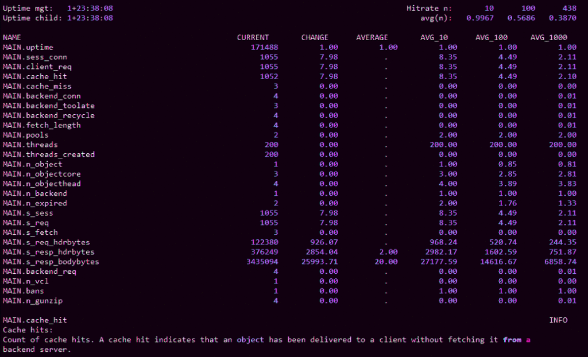
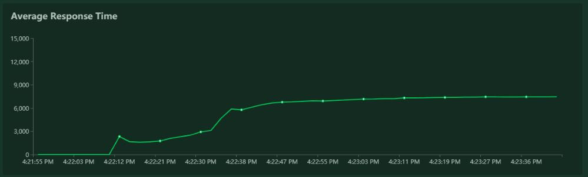
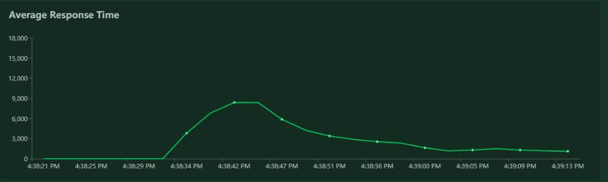
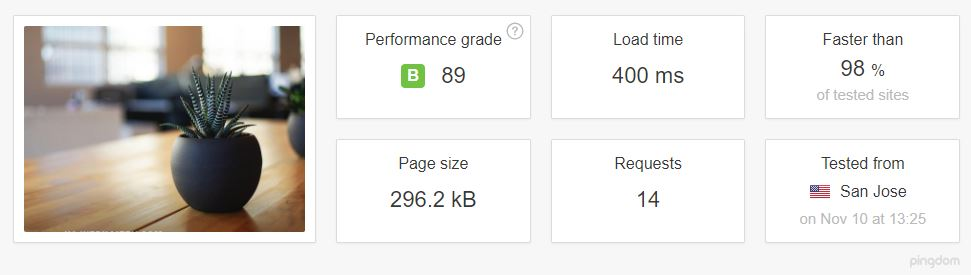
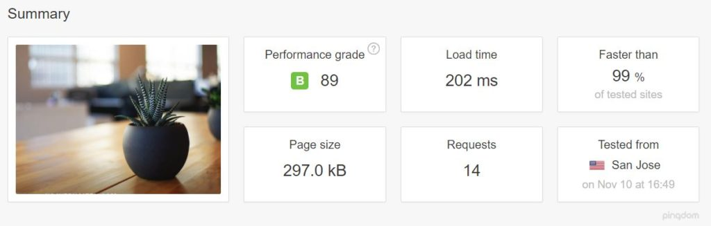
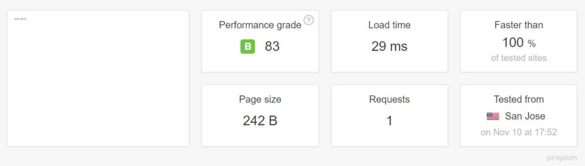
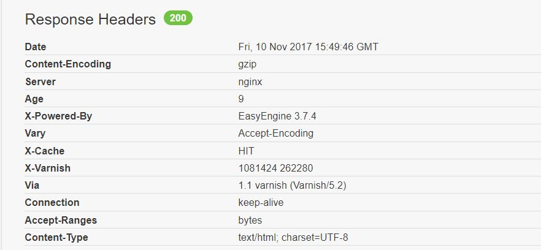

Varnish Cache is an [HTTP accelerator](https://en.wikipedia.org/wiki/Web_accelerator) and [reverse proxy](https://en.wikipedia.org/wiki/Reverse_proxy) developed by Danish consultant and FreeBSD core developer [Poul-Henning Kamp](https://www.wikiwand.com/en/Poul-Henning_Kamp), along with other developers at Norwegian [Linpro AS](https://www.redpill-linpro.com/). It was [released](https://varnish-cache.org/lists/pipermail/varnish-announce/2006-September/000638.html) in 2006.

[According to Pingdom.com](http://royal.pingdom.com/2012/07/11/how-popular-is-varnish/), a company focused on web performance, in 2012 Varnish was already famous among the world's top websites for its capacity to speed up web delivery, and it was being used by sites such as Wired, SlideShare, Zappos, SoundCloud, Weather.com, Business Insider, Answers.com, Urban Dictionary, MacRumors, DynDNS, OpenDNS, Lonely Planet, Technorati, ThinkGeek and Economist.com.

It is licensed under a two-clause [BSD license](https://www.wikiwand.com/en/BSD_license). Varnish has a premium tier, [Varnish Plus](https://www.varnish-software.com/pricing/varnish-plus/), focused on enterprise customers, which offers some [extra features, modules, and support](https://www.varnish-software.com/products/varnish-plus/).

Although there are other solutions that also [shine](https://deliciousbrains.com/page-caching-varnish-vs-nginx-fastcgi-cache/), Varnish is still a go-to solution that can dramatically improve website speed, reduce the strain on the web application server's CPU, and even serve as a [protection layer from DDoS](https://www.htpcguides.com/wordpress-ddos-attack-protection-varnish-4-firewall/) attacks. [KeyCDN recommends](https://www.keycdn.com/support/using-a-varnish-cdn-stack-with-keycdn/) deploying it on the origin server stack.

Varnish can sit on a dedicated machine in case of more demanding websites, and make sure that the origin servers aren't affected by the flood of requests.

At the time of this writing (November 2017), Varnish is at version [5.2](https://varnish-cache.org/docs/5.2/whats-new/changes-5.2.html).

## How It Works

[Caching](https://en.wikipedia.org/wiki/Cache_(computing)) in general works by keeping the pre-computed outputs of an application in memory, or on the disk, so that expensive computations don't have to be computed over and over on every request. [Web Cache](https://en.wikipedia.org/wiki/Web_cache) can be on the client (browser cache), or on the server. Varnish falls into the second category. It is usually configured so that it listens for requests on the standard HTTP port (80), and then serves the requested resource to the website visitor.


The first time a certain URL and path are requested, Varnish has to request it from the origin server in order to serve it to the visitor. This is called a CACHE MISS, which can be read in HTTP response headers, depending on the Varnish setup.

According to the [docs](https://www.varnish-software.com/wiki/faq/index.html):

> when an object, any kind of content i.e. an image or a page, is not stored in the cache, then we have what is commonly known as a cache miss, in which case Varnish will go and fetch the content from the web server, store it and deliver a copy to the user and retain it in cache to serve in response to future requests.

When a particular URL or a resource is cached by Varnish and stored in memory, it can be served directly from server RAM; it doesn't need to be computed every time. Varnish will start delivering a CACHE HIT in a matter of microseconds.



This means that neither our origin server or our web application, including its database, are touched by future requests. They won't even be aware of the requests loaded on cached URLs.

The origin server --- or servers, in case we [use Varnish as a load balancer](http://opentsdb.net/docs/build/html/user_guide/utilities/varnish.html) --- are configured to listen on some non-standard port, like 8888, and Varnish is [made aware of their address and port](http://devdocs.magento.com/guides/v2.1/config-guide/varnish/config-varnish-configure.html).

## Varnish Features

**Varnish is [threaded](https://book.varnish-software.com/4.0/chapters/Tuning.html#threading-model).** It's been [reported](https://kly.no/posts/2010_01_26__Varnish_best_practices__.html) that Varnish was able to handle over 200,000 requests per second on a single instance. If properly configured, the only bottlenecks of your web app will be network throughput and the amount of RAM. (This shouldn't be an unreasonable requirement, because it just needs to keep computed web pages in memory, so for most websites, a couple of gigabytes should be sufficient.)

**Varnish is extendable via [VMODS](https://info.varnish-software.com/blog/varnish-modules-vmods-overview)**. These are modules that can use standard C libraries and extend Varnish functionality. There are community-contributed VMODS listed [here](https://varnish-cache.org/vmods/). They range from header manipulation to Lua scripting, throttling of requests, authentication, and so on.

**Varnish has its own domain-specific language, [VCL](http://book.varnish-software.com/4.0/chapters/VCL_Basics.html)**. VCL provides comprehensive configurability. With a full-page caching server like Varnish, there are a lot of intricacies that need to be solved.



When we cache a dynamic website with dozens or hundreds of pages and paths, with GET query parameters, we'll want to exclude some of them from cache, or set different cache-expiration rules. Sometimes we'll want to cache certain Ajax requests, or exclude them from the cache. This varies from project to project, and can't be tailored in advance.

Sometimes we'll want Varnish to decide what to do with the request depending on request headers. Sometimes we'll want to pass requests directly to the back end with a certain cookie set.

To quote the [Varnish book](http://book.varnish-software.com/4.0/chapters/VCL_Basics.html#summary-of-vcl-basics),

> VCL provides subroutines that allow you to affect the handling of any single request almost anywhere in the execution chain.

Purging the cache often needs to be done dynamically --- triggered by publishing articles or updating the website. Purging also needs to be done as atomically as possible --- meaning it should target the smallest possible scope, like a single resource or path.

This means that specific rules need to be defined, with their order of priority in mind. Some examples can be found in the Varnish book (which is available to read [online](http://book.varnish-software.com/4.0/chapters/VCL_Basics.html) or as a [downloadable PDF](https://info.varnish-software.com/the-varnish-book)).

Varnish has a set of [tools for monitoring and administering the server](http://book.varnish-software.com/4.0/chapters/Appendix_B__Varnish_Programs.html):

*   There's `varnishtop`, which lets us monitor requested URLs and their frequency.

*   `varnishncsa` can be used to print the _Varnish Shared memory Log_ (VSL): it dumps everything pointing to a certain domain and subdomains.

*   `varnishhist` reads the VSL and presents a live histogram showing the distribution of the last number of requests, giving an overview of server and back-end performance.

*   `varnishtest` is used to test VCL configuration files and develop VMODS.

*   `varnishstat` displays statistics about our varnishd instance:

    

*   `varnishlog` is used to get data about specific clients and requests.

[Varnish Software](https://www.varnish-software.com/) offers a set of commercial, paid solutions either built on top of Varnish cache, or extending its usage and helping with monitoring and management: [Varnish Api Engine](https://www.varnish-software.com/products/varnish-api-engine/), [Varnish Extend](https://www.varnish-software.com/products/varnish-extend/), [Akamai Connector for Varnish](https://www.varnish-software.com/products/akamai-connector-for-varnish/), [Varnish Administration Console (VAC)](https://www.varnish-software.com/plus/varnish-administration-console/), and [Varnish Custom Statistics (VCS)](https://www.varnish-software.com/plus/varnish-custom-statistics/).

## Installing Varnish

The Varnish docs [cover installation on various systems](https://varnish-cache.org/docs/5.0/installation/install.html). We'll go with Ubuntu 16.04 LTS in this post.

[Packagecloud.io](https://packagecloud.io/varnishcache/varnish5/install#manual-deb) has instructions for updating the Ubuntu repositories and installing Varnish version 5:

```bash
curl -L https://packagecloud.io/varnishcache/varnish5/gpgkey | sudo apt-key add -
sudo apt-get update
sudo apt-get install -y apt-transport-https
```

Then we add the following lines to the newly created file `/etc/apt/sources.list.d/varnishcache_varnish5.list`:

```bash
deb https://packagecloud.io/varnishcache/varnish5/ubuntu/ xenial main
deb-src https://packagecloud.io/varnishcache/varnish5/ubuntu/ xenial main
```

Then we run:

```bash
sudo apt-get update
sudo apt-get install varnish
```

We can test a brand-new WordPress installation running on Nginx. First, we change Nginx's default listening port from 80 to 8080 --- which is the port Varnish expects the back end to be running on --- by adding the following lines to the Nginx virtual host, inside the server clause:

```cnf
server {       
    listen 127.0.0.1:8080 default_server;
    listen [::]:8080 default_server;
```

Then we configure Varnish: we edit `/etc/default/varnish`, replacing port 6081 with 80 (the default web port):

```cnf
DAEMON_OPTS="-a :80 \
    -T localhost:6082 \
    -f /etc/varnish/default.vcl \
    -S /etc/varnish/secret \
    -s malloc,256m"
```

We also need to change `/lib/systemd/system/varnish.service`, making the same replacement:

```cnf
[Service]
Type=simple
LimitNOFILE=131072
LimitMEMLOCK=82000
ExecStart=/usr/sbin/varnishd -j unix,user=vcache -F -a :80 -T localhost:6082 ⤶
-f /etc/varnish/default.vcl -S /etc/varnish/secret -s malloc,256m
ExecReload=/usr/share/varnish/reload-vcl
ProtectSystem=full
ProtectHome=true
PrivateTmp=true
PrivateDevices=true
```

Then we restart Nginx and Varnish:

```bash
sudo service nginx restart
sudo /etc/init.d/varnish restart
```

_Warning: due to some peculiarities, Varnish usually must be restarted --- or started this way, not with `service varnish start` --- in order to read all the config files we edited._

We tested the website speed and responsiveness with [Locust](https://locust.io) and [Pingdom Tools](https://tools.pingdom.com).

Once the cache was warmed up, the difference was impressive, despite Nginx being well known for its speed: _the average number of requests per second was multiplied by three to four times_, and response time were greatly reduced. Load times were a bit higher due to network latency, since we tested the website hosted in California from a workstation in Europe.

**Locust results for Nginx:**



**Locust results for Nginx + Varnish:**



Pingdom results were also good.

**Pingdom results for Nginx stack, tested from California:**



**Pingdom results for Nginx + Varnish, California:**



Notice also the [TTFB](https://en.wikipedia.org/wiki/Time_to_first_byte) for each case.

**Nginx alone:**


**Nginx + Varnish:**


Even if we neglect the pink part, which is the DNS lookup, there is still an obvious difference.

## Simplicity of Setup

Varnish doesn't care what's listening on port 8080 (we can change this default port as well, if required). This means that setting up Apache, or some other application server, should be just as straightforward: all we need to do is to configure them to listen on port 8080 instead of 80.

### Setting up Varnish with NodeJS

On our existing server, where we had already installed Varnish, setting up a hello-world Node app was just as simple. We installed the `nodejs` and `npm` packages and linked NodeJS to Node:

```bash
ln -s /usr/bin/nodejs /usr/bin/node
```

Then we created a simple node _hello-world_ program listening on port 8080:

```javascript
#!/usr/bin/env nodejs

var http = require('http');
http.createServer(function (req, res) {
        res.writeHead(200, {'Content-Type': 'text/plain'});
        res.end('Hello World\n');
}).listen(8080, 'localhost');

console.log('Server running at http://localhost:8080/');
```

Then we installed Node's package manager, [PM2](http://pm2.keymetrics.io/), to be able to daemonize our app:

```bash
sudo npm install -g pm2

pm2 start index.js
```

aAnd voila --- our Node app was being served by Varnish:



## Other Tips

To be able to control whether or not our request is being cached in our browser inspector, we ought to add the following snippet to our Varnish config file, into the `sub vcl_deliver` block:

```javascript
sub vcl_deliver {
    if (obj.hits > 0) {
    set resp.http.X-Cache = "HIT";
    } else {
    set resp.http.X-Cache = "MISS";
    }
}
```

Then we can see the feedback in our response headers as _HIT or MISS_:



One more warning: Varnish (or at least the open-source version) [doesn't support SSL](https://varnish-cache.org/docs/trunk/phk/ssl.html), reiterated [again](https://varnish-cache.org/docs/trunk/phk/ssl_again.html) by its creator Poul-Henning Kamp (who is [not shy to voice his opinions](http://queue.acm.org/detail.cfm?id=2716278)). So when you need to use Varnish and HTTPS, consider using another proxy in front of it for [SSL termination](https://komelin.com/articles/https-varnish) --- such as [haproxy](https://z0z0.me/create-your-own-cdn-with-haproxy-and-varnish/), or Varnish's own [hitch](https://github.com/varnish/hitch).

Or, if that's getting too involved, just use [Nginx and FastCGI Cache](https://www.scalescale.com/tips/nginx/configure-nginx-fastcgi-cache/#).

## Conclusion

In this article we tried to give a brief introduction to Varnish Cache without going too deeply into its setup, monitoring and administration.

Tuning server performance is a science of its own, and presenting the full scope of use cases and setups requires another article. I'll be diving a bit deeper into this subject in another article, so stay tuned for a future installment, where I'll add Varnish in front of a real app.
