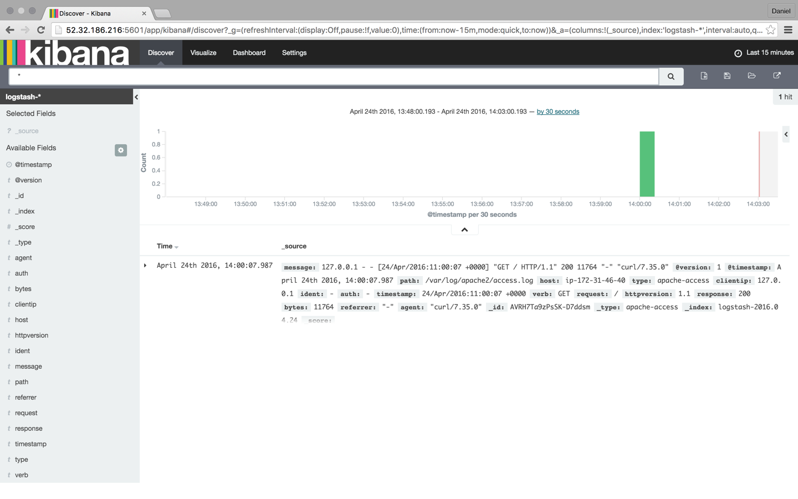

When things go south with our applications -- as they sometimes do, whether we like it or not -- our log files are normally among the first places where we go when we start the troubleshooting process. The big “but” here is that despite the fact that log files contain a wealth of helpful information about events, they are usually extremely difficult to decipher.

A modern web application environment consists of multiple log sources, which collectively output thousands of log lines written in unintelligible machine language. If you, for example, have a LAMP stack set up, then you have PHP, Apache, and MySQL logs to go through. Add system and environment logs into the fray -- together with framework-specific logs such as Laravel logs -- and you end up with an endless pile of machine data.

Talk about a needle in a haystack.


The ELK Stack ([Elasticsearch](https://github.com/elastic/elasticsearch), [Logstash](https://github.com/elastic/logstash), and [Kibana](https://github.com/elastic/kibana)) is quickly becoming the most popular way to handle this challenge. Already the most popular open-source log analysis platform -- with 500,000 downloads a month, according to Elastic -- ELK is a great way to centralize logs from multiple sources, identify correlations, and perform deep-data analysis.

Elasticsearch is a search-and-analytics engine based on Apache Lucene that allows users to search and analyze large amounts of data in almost real time. Logstash can ingest and forward logs from anywhere to anywhere. Kibana is the stack’s pretty face -- a user interface that allows you to query, visualize, and explore Elasticsearch data easily.

This article will describe how to set up the ELK Stack on a local development environment, ship web server logs (Apache logs in this case) into Elasticsearch using Logstash, and then analyze the data in Kibana.

## Installing Java

The ELK Stack requires Java 7 and higher (only Oracle’s Java and the OpenJDK are supported), so as an initial step, update your system and run the following:

```bash
sudo apt-get install default-jre
```

## Installing ELK

There are numerous ways of installing the ELK Stack -- you can use Docker, Ansible, Vagrant, Microsoft Azure, AWS, or a hosted ELK solution -- just take your pick. There is a vast number of tutorials and guides that will help you along the way, one being this [ELK Stack guide](http://logz.io/learn/complete-guide-elk-stack/) that we at [Logz.io](http://logz.io) put together.

### Installing Elasticsearch

We’re going to start the installation process with installing Elasticsearch. There are various ways of setting up Elasticsearch but we will use Apt.

First, download and install Elastic’s public signing key:

```bash
wget -qO - https://packages.elastic.co/GPG-KEY-elasticsearch | sudo apt-key add -
```

Next, save the repository definition to `/etc/apt/sources.list.d/elasticsearch-2.x.list`:

```bash
echo "deb http://packages.elastic.co/elasticsearch/2.x/debian stable main" | sudo tee -a /etc/apt/sources.list.d/elasticsearch-2.x.list
```

Last but not least, update the repository cache and install Elasticsearch:

```bash
sudo apt-get update && sudo apt-get install elasticsearch
```

Elasticsearch is now installed. Before we continue to the next components, we’re going to tweak the configuration file a bit:

```bash
sudo nano /etc/elasticsearch/elasticsearch.yml
```

Some common configurations involve the restriction of external access to Elasticsearch, so data cannot be hacked or deleted via HTTP API:

```yaml
network.host: localhost
```

You can now restart Elasticsearch:

```bash
sudo service elasticsearch restart
```

To verify that Elasticsearch is running properly, query the following URL using the cURL command:

```bash
sudo curl 'http://localhost:9200'
```

You should see the following output in your terminal:

```javascript
{
    "name" : "Jebediah Guthrie",
    "cluster_name" : "elasticsearch",
    "version" : {
    "number" : "2.3.1",
    "build_hash" : "bd980929010aef404e7cb0843e61d0665269fc39",
    "build_timestamp" : "2016-04-04T12:25:05Z",
    "build_snapshot" : false,
    "lucene_version" : "5.5.0"
    },
    "tagline" : "You Know, for Search"
}
```

To make the service start on boot, run:

```bash
sudo update-rc.d elasticsearch defaults 95 10
```

### Installing Logstash

Logstash, the "L" in the "ELK Stack", is used at the beginning of the log pipeline, ingesting and collecting data before sending it on to Elasticsearch.

To install Logstash, add the repository definition to your `/etc/apt/sources.list` file:

```bash
echo "deb http://packages.elastic.co/logstash/2.2/debian stable main" | sudo tee -a /etc/apt/sources.list
```

Update your system so that the repository will be ready for use and then install Logstash:

```bash
sudo apt-get update && sudo apt-get install logstash
```

We’ll be returning to Logstash later to configure log shipping into Elasticsearch.

### Installing Kibana

The final piece of the puzzle is Kibana - the ELK Stack's pretty face. First, create the Kibana source list:

```bash
echo "deb http://packages.elastic.co/kibana/4.5/debian stable main" | sudo tee -a /etc/apt/sources.list
```

Then, update and install Kibana:

```bash
sudo apt-get update && apt-get install kibana
```

Configure the Kibana configuration file at `/opt/kibana/config/kibana.yml`:

```bash
sudo vi /opt/kibana/config/kibana.yml
```

Uncomment the following lines:

```yaml
server.port: 5601
server.host: “0.0.0.0”
```

Last but not least, start Kibana:

```bash
sudo service kibana start
```

You can access Kibana in your browser at `http://localhost:5601/` (change the URL if you're using a VM like [Homestead Improved](http://www.sitepoint.com/quick-tip-get-homestead-vagrant-vm-running/) to whichever host/port you configured):


To start analyzing logs in Kibana, at least one index pattern needs to be defined. An index is how Elasticsearch organizes data, and it can be compared to a database in the world of RDBMS, with mapping defining multiple types.

You will notice that since we have not yet shipped any logs, Kibana is unable to fetch mapping (as indicated by the grey button at the bottom of the page). We will take care of this in the next few steps.

**Tip:** By default, Kibana connects to the Elasticsearch instance running on localhost, but you can connect to a different Elasticsearch instance. Simply modify the Elasticsearch URL in the Kibana configuration file that you had edited earlier and then restart Kibana.

## Shipping Logs

Our next step is to set up a log pipeline into Elasticsearch for indexing and analysis using Kibana. There are various ways of forwarding data into Elasticsearch, but we’re going to use Logstash.

Logstash configuration files are written in JSON format and reside in `/etc/logstash/conf.d`. The configuration consists of three plugin sections: input, filter, and output.

Create a configuration file called `apache-logs.conf`:

```bash
sudo vi /etc/logstash/conf.d/apache-logs.conf
```

Our first task is to configure the input section, which defines where data is being pulled from.

In this case, we’re going to define the path to our Apache access log, but you could enter a path to any other set of log files (e.g. the path to your PHP error logs).

_Before doing so, however, I recommend doing some research into supported input plugins and how to define them. In some cases, other log forwarders such as [Filebeat](https://www.elastic.co/products/beats/filebeat) and [Fluentd](http://www.fluentd.org/) are recommended._

The input configuration:

```conf
input {
    file {
        path => "/var/log/apache2/access.log"
        type => "apache-access"
    }
}
```
Our next task is to configure a filter.

Filter plugins allow us to take our raw data and try to make sense of it. One of these plugins is grok -- a plugin used to derive structure out of unstructured data. Using grok, you can define a search and extract part of your log lines into structured fields.

```conf
filter {
    if [type] == "apache-access" {
    grok {
        match => { "message" => "%{COMBINEDAPACHELOG}" }
    }
    }
}
```

The last section of the Logstash configuration file is the Output section, which defines the location to where the logs are sent. In our case, it is our local Elasticsearch instance on our localhost:

```javascript
output {
    elasticsearch {}
}
```

That’s it. Once you’re done, start Logstash with the new configuration:

```bash
/opt/logstash/bin/logstash -f /etc/logstash/conf.d/apache-logs.conf
```

You should see the following JSON output from Logstash indicating that all is in order:

```javascript
{
        "message" => "127.0.0.1 - - [24/Apr/2016:11:41:59 +0000] \"GET / HTTP/1.1\" 200 11764 \"-\" \"curl/7.35.0\"",
        "@version" => "1",
        "@timestamp" => "2016-04-24T11:43:34.245Z",
            "path" => "/var/log/apache2/access.log",
            "host" => "ip-172-31-46-40",
            "type" => "apache-access",
        "clientip" => "127.0.0.1",
            "ident" => "-",
            "auth" => "-",
        "timestamp" => "24/Apr/2016:11:41:59 +0000",
            "verb" => "GET",
        "request" => "/",
    "httpversion" => "1.1",
        "response" => "200",
            "bytes" => "11764",
        "referrer" => "\"-\"",
            "agent" => "\"curl/7.35.0\""
}
```

Refresh Kibana in your browser, and you’ll notice that the index pattern for our Apache logs was identified:


Click the **Create** button, and then select the Discover tab:



From this point onwards, Logstash is tailing the Apache access log for messages so that any new entries will be forwarded into Elasticsearch.

## Analyzing Logs

Now that our pipeline is up and running, it’s time to have some fun.

To make things a bit more interesting, let’s simulate some noise on our web server. To do this I’m going to download some [sample Apache logs](http://logz.io/sample-data) and insert them into the Apache access log. Logstash is already tailing this log, so these messages will be indexed into Elasticsearch and displayed in Kibana:

```bash
wget http://logz.io/sample-data
sudo -i
cat /home/ubuntu/sample-data >> /var/log/apache2/access.log
exit
```


### Searching

Searching is the bread and butter of the ELK Stack, and it’s an art unto itself. There is a large amount of documentation available online, but I thought I’d cover the essentials so that you will have a solid base from which to start your exploration work.

Let’s start with some simple searches.

The most basic search is the “free text” search that is performed against all indexed fields. For example, if you’re analyzing web server logs, you could search for a specific browser type (searching is performed using the wide search box at the top of the page):

```
Chrome
```

It’s important to note that free text searches are NOT case-sensitive unless you use double quotes, in which case the search results show exact matches to your query.

```
“Chrome”
```

Next up are the field-level searches.

To search for a value in a specific field, you need to add the name of the field as a prefix to the value:

```
type:apache-access
```

Say, for example, that you’re looking for a specific web server response. Enter `response:200` to limit results to those containing that response.

You can also search for a range within a field. If you use brackets [], the results will be inclusive. If you use curly braces {}, the results will exclude the specified values in the query.

Now, it’s time to take it up a notch.

The next types of searches involve using logical statements. These are quite intuitive but require some finesse because they are extremely syntax-sensitive.

These statements include the use of the Boolean operators AND, OR, and NOT:

```
type:apache-access AND (response:400 OR response:500)
```

In the above search, I’m looking for Apache access logs with only a 400 or 500 response. Note the use of parentheses as an example of how more complex queries can be constructed.

There are many more search options available (I recommend referring to Logz.io's [Kibana tutorial](http://logz.io/blog/kibana-tutorial/) for more information) such as regular expressions, fuzzy searches, and proximity searches, but once you’ve pinpointed the required data, you can save the search for future reference and as the basis to create Kibana visualizations.

### Visualizing

One of the most prominent features in the ELK Stack in general and Kibana in particular is the ability to create beautiful visualizations with the ingested data. These visualizations can then be aggregated into a dashboard that you can use to get a comprehensive view of all the various log files coming into Elasticsearch.

To create a visualization, select the Visualize tab in Kibana:


There are a number of visualization types that you can select, and which type you will choose will greatly depend on the purpose and end-result you are trying to achieve. In this case, I’m going to select the good ol’ pie chart.

We then have another choice -- we can create the visualization from either a saved search or a new search. In this case, we’re going with the latter.

Our next step is to configure the various metrics and aggregations for the graph’s X and Y axes. In this case, we’re going to use the entire index as our search base (by not entering a search query in the search box) and then cross reference the data with browser type: Chrome, Firefox, Internet Explorer, and Safari:


Once you are finished, save the visualization. You can then add it to a custom dashboard in the Dashboard tab in Kibana.

Visualizations are incredibly rich tools to have, and they are the best way to understand the trends within your data.

## Conclusion

The ELK Stack is becoming THE way to analyze and manage logs. The fact that the stack is open source and that it’s backed by a strong community and a fast growing ecosystem is driving its popularity.

DevOps is not the sole realm of log analysis, and ELK is being used by developers, sysadmins, SEO experts, and marketers as well. Log-driven development -- the development process in which code is monitored using metrics, alerts, and logs -- is gaining traction within more and more R&D teams, and it would not be a stretch of the imagination to tie this to the growing popularity of ELK.

Of course, no system is perfect and there are pitfalls that users need to avoid, especially when handling big production operations. But this should not deter you from trying it out, especially because there are numerous sources of information that will guide you through the process.

Good luck, and happy indexing!

_This article was [peer reviewed](http://www.sitepoint.com/introduction-to-sitepoints-peer-review/) by [Christopher Thomas](http://www.sitepoint.com/author/cthomas/), [Younes Rafie](http://www.sitepoint.com/author/yrafie/), and [Scott Molinari](http://www.sitepoint.com/author/smolinari/). Thanks to all of SitePoint’s peer reviewers for making SitePoint content the best it can be!_
